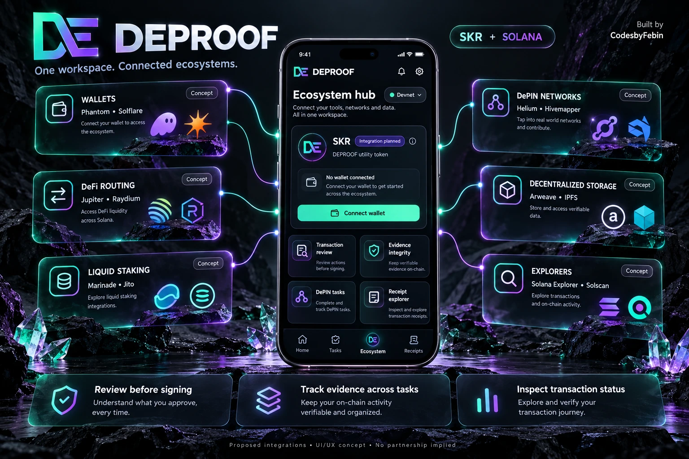
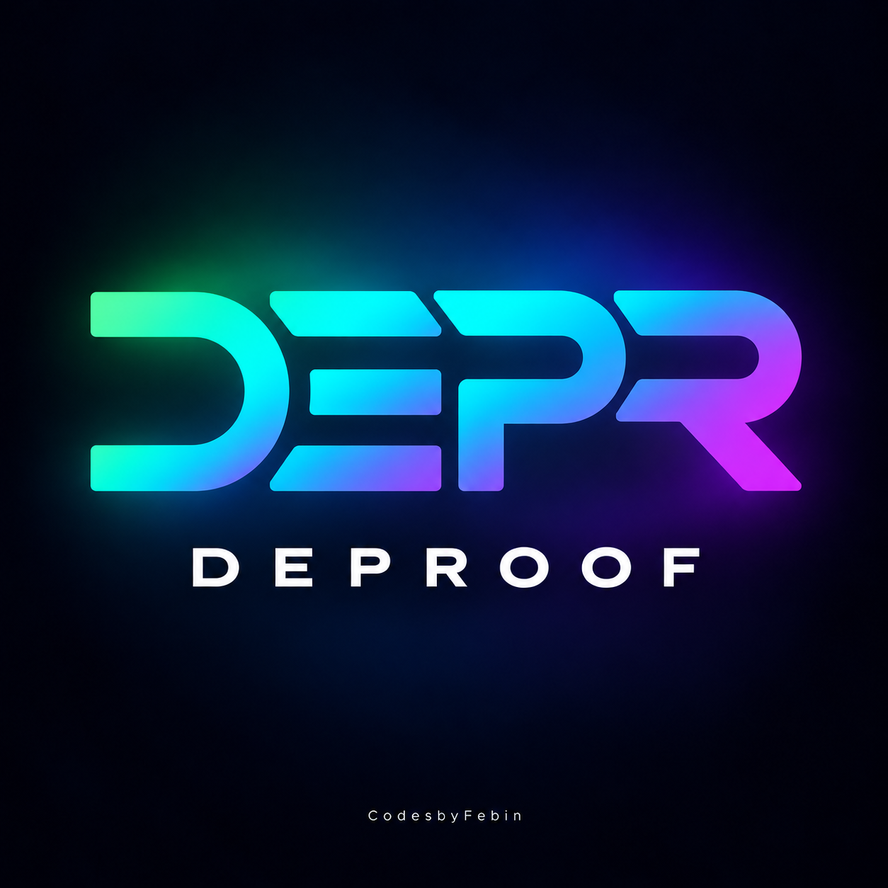
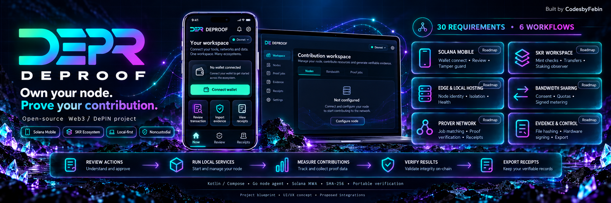

# DEPROOF — FINAL MERGED MASTER BUILD PROMPT

Version: 3.0 • Updated 2026-10-06, Asia/Kolkata • Unified open-source Web3/DePIN technical, design and ecosystem specification.

Copy this entire document into your coding agent on the target development machine. This is a build instruction, not a claim that the attached prototype or any feature has passed testing. The reference images guide appearance; their text and badges are not technical evidence.

## 1. Mission and authority

Build **Deproof** from scratch as an open-source, noncustodial, local-first Web3/DePIN DApp project: a native Solana Mobile application, user-controlled edge/local-hosting agent, contribution and prover-network adapters, portable evidence/transaction receipts, and a public documentation site. The focused Android core remains the first qualified release. Implement, integrate, test, debug, package, and document executable behavior. Start with the smallest genuine vertical slice, then progress through the dependency gates below. Do not stop at a plan or a collection of attractive screens.

Brand: Deproof. Creator: Febin Francis — CodesbyFebin. Primary tagline: **See, understand, verify before you sign.** Short marketing line: **Review. Sign. Verify.** Use the rounded DEPR monogram, not an S or a standalone D. Credit CodesbyFebin in Android About and in website/repository footers.

This merged document supersedes contradictory source instructions. Its integrated design appendix and companion DEPROOF_DESIGN_SPEC.md govern visual implementation; transaction/security rules govern if decorative references disagree. The corrected transaction, cryptography, provenance, and qualification rules here govern every checklist, function, roadmap item, and visual reference. Source examples are requirements evidence, not code to paste blindly. Preserve user data and existing repository identity if working from the archive instead of a new directory.

There are **120 base product features (F001–F120)**, **100 core acceptance checks (C001–C100)**, **62 base function contracts (FN001–FN062)**, and **30 mandatory ecosystem requirements (E001–E030)** with 24 new typed extension contracts (EF001–EF024). The core checklist overlaps product features; it is not another 100 unique features. Ecosystem requirements explicitly map to overlapping base features and new extension work; do not claim 150 unique features by adding overlapping registries. The 30 requirements are mandatory for the final requested ecosystem scope, staged by dependency; LATER does not mean waived. Research backlog items are not delivered features. None starts VERIFIED merely because an old sheet says Live.

## 2. Scope, phases, and resolved defaults

| Phase | Deliverable | Dependency and completion rule |
| --- | --- | --- |
| P0 | Reproducible Android foundation | Clean debug build and passing domain tests; no credentials required |
| P1 | Three-screen release core: Now, Review, Receipts | Account observation, strict decoder, complete-message review binding, real devnet wallet proof, file hashing, honest persistent receipts |
| P2 | Tasks and richer Evidence subflows | Working capture/import, checklists, previews, multiple attachments and process recovery; reachable inside the existing three destinations |
| P3 | Verified SKR staking/claims and ecosystem adapters | Current official interfaces, attributable data, tested adapters, meaningful qualification; dependent features remain blocked until then |
| P4 | Companion marketing/documentation site and release packaging | Accurate implementation status; responsive working navigation; publish only when authorized |
| P5 | Optional provider services and broader research backlog | Concrete need, supported integration, noncustodial boundaries, separately qualified |

Retain the three Android top-level destinations through P2. In later ecosystem phases, add nested Nodes, Bandwidth and Proof jobs routes through Now; do not silently replace core navigation with the four-tab generated concept. Put Tasks in Now and Evidence in task/review details. The five-screen promotional designs depict workflows, not a mandatory five-tab navigation. The website is part of the wider project, not a prerequisite for the Android P1 build. Do not create a second consumer app or a marketplace just to inflate the count.

Core operates locally without a custom server. Public RPC is an external dependency. A later server may protect provider credentials, support consented AI explanation, proxy rate-limited RPC, or ingest authorized connector data. It must never custody wallet keys. The request to use another server means portable build instructions; do not assume any server, credentials, or deployment already exists.

Statuses for features/functions: NOT_STARTED, IMPLEMENTING, IMPLEMENTED_UNVERIFIED, VERIFIED, BLOCKED, LATER. Individual checks: PASS, FAIL, NOT_RUN, NOT_APPLICABLE with a reason. LATER and BLOCKED are incomplete. Fixture-only tests do not qualify a device integration. UI shows readable equivalents such as Planned, Needs device test, Unavailable, and Verified with evidence context. Do not use “Safe” or imply policy eligibility guarantees safety.

Create `features.json`, `core-checks.json`, and `functions.json`. Include IDs, phase, problem, dependencies, implementation paths, expected behavior, tests, status, evidence paths, limitations, and source mappings. Map every C and FN to relevant F IDs; never double-count overlapping requirements.

## 3. Inspect the machine, then pin a compatible stack

Inspect OS, disk, JDK, Android SDK, Gradle, repository, network access, and device availability. Use native **Kotlin, Jetpack Compose, Material 3, Coroutines/Flow, Room, DataStore, Android Keystore**, a maintained HTTP/JSON library, and a tested Solana message implementation. Use one Android application module initially with clear package boundaries; introduce library modules only when justified. Do not switch to Expo/React Native silently. Expo Go cannot qualify native wallet or Keystore behavior.

Fresh-build compatibility defaults from the latest source:

- applicationId: `com.aistudio.deproof.sdwk`
- namespace: `com.example`
- launcher activity: `com.example.MainActivity`
- minSdk: 24, with capability guards for newer hardware APIs.
- Source MWA dependency candidate: `com.solanamobile:mobile-wallet-adapter-clientlib-ktx:2.0.7`.

These are supplied defaults, not proof of current support. Verify SDK/JDK/Gradle/Compose/MWA compatibility from official documentation during implementation, pin the resolved versions, and record changes in `docs/dependency-decisions.md`. Do not restrict fallback to an old minor series if that prevents a supported integration. Install a suitable SDK when possible; release target must meet current distribution requirements, not merely whatever SDK happens to be installed. Preserve package identity if updating an existing distributed app.

Configure a developer-controlled MWA identity URI. `https://deproof.app` is only a supplied candidate; do not claim ownership or a deployed site without evidence. Record the actual configured URI and resolved account-field representation. Base58-encode protocol account bytes; never confuse an account address with its chain identifier. Redact authorization tokens from logs.

Builds must work without `.env`, an AI key, Firebase, or `google-services.json`. Do not apply Google Services without a real requirement. Fix quoted Gradle string generation rather than creating mandatory fake secrets. Keep provider secrets out of APK BuildConfig and website bundles. Commit `.env.example` only for services that need it. Use maintained CI actions and verified current runtime versions.

Suggested layout:

```text
app/                         Android application, domain, UI, RPC, wallet, persistence
contracts/                   Receipt/manifest schemas and serialization vectors
fixtures/                    Labeled synthetic and attributable network fixtures
scripts/                     Build, qualification and packaging scripts
docs/                        Architecture, threat model, status and integration notes
evidence/                    Sanitized test logs, device records and checksums
web/                         P4 marketing/documentation website
server/                      Optional P5 services; absent until justified
.github/workflows/           CI configuration
```

Pure decoder, money, policy, canonicalization and state transitions run on the JVM without Android imports. Use a JVM-capable serialization library. Android `org.json` stubs must not silently replace real serialization in JVM tests. Do not write ad hoc JSON escaping code for receipts.

## 4. Protocol constants and source verification

The following values were supplied by the source documents. Preserve them as **candidates requiring official-source and cluster validation**, not as facts independently verified by this merge review. Before enabling a dependent signing path, record official source URL, retrieval date, relevant interface/version, program/mint account ownership, and fixtures in `docs/protocol-sources.md`. If validation disagrees, block the action and show the discrepancy; do not substitute a lookalike.

| Item | Supplied candidate |
| --- | --- |
| SPL Token program | `TokenkegQfeZyiNwAJbNbGKPFXCWuBvf9Ss623VQ5DA` |
| Token-2022 program | `TokenzQdBNbLqP5VEhdkAS6EPFLC1PHnBqCXEpPxuEb` |
| SKR mint | `SKRbvo6Gf7GondiT3BbTfuRDPqLWei4j2Qy2NPGZhW3` |
| SKR expected decimals | `6` |
| System program | `11111111111111111111111111111111` |
| Memo program | `MemoSq4gqABAXKb96qnH8TysNcWxMyWCqXgDLGmfcHr` |
| Native SOL stake program | `Stake11111111111111111111111111111111111111` |
| SKR staking program | `SKRskrmtL83pcL4YqLWt6iPefDqwXQWHSw9S9vz94BZ` |
| Associated Token program | `ATokenGPvbdGVxr1b2hvZbsiqW5xWH25efTNsLJA8knL` |

Default public RPC candidates: `https://api.mainnet-beta.solana.com` and `https://api.devnet.solana.com`. Persist user overrides with validated HTTPS URLs; permit cleartext only in explicitly isolated local development. Redact credential-bearing URLs. Verify cluster identity/genesis context; cluster is not encoded in a Solana public key.

Strict SKR TransferChecked codec: discriminator u8=12, amount unsigned u64 little-endian at offset 1, decimals u8 at offset 9, exactly 10 bytes. Require source, mint, destination, authority in order for the initial single-authority path. Reject unsupported multisig extensions rather than guessing. Compare complete IDs, decode addresses to 32 bytes, and validate required signer/writable roles, token-account ownership/state, mint linkage, frozen state, source authorization, destination token account and requested recipient. Showing a wallet recipient is not the same as showing its token-account address; expose both.

Refuse unchecked Transfer(3), Approve(4), Revoke(5), SetAuthority(6), MintTo(7), Burn(8), CloseAccount(9), ApproveChecked(13), BurnChecked(14), and unknown token instructions in the initial authorization policy. Token-2022 is a separate program and unsupported in this strict path until explicitly qualified.

Native SOL stake uses a u32 discriminator: supplied mappings 0 initialize, 1 authorize, 2 delegate, 3 split, 4 withdraw, 5 deactivate, 7 merge. Validate these in fixtures against its own official interface. Label these **SOL stake**, never SKR stake; no signing in P1. SKR stake uses its own verified program interface/IDL and account layouts. A program ID alone does not supply a codec. Without verified layouts: `SKR stake layout not verified. Do not sign.`

Cooldown duration, reward cessation, inflation, APY, guardian identity, season deadlines, Genesis/device eligibility and fee floors require current attributable protocol sources. The supplied 48-hour, 90-day, 10%/25%/2%, and 0.015 SOL numbers are not universal execution rules. The original 2026-10-05 source included a future-dated 2026-10-06 documentation-read claim; do not inherit that claim. Record sources actually read during implementation. Local illustrative timers are labeled user supplied; expiry never enables withdrawal.

SKR must not be branded as a Deproof-issued utility token. Distinguish Solana Mobile ecosystem integration from project token issuance. Do not claim a prize qualification, partnership, hackathon deadline, production audit, or historical incident without verifying its source.

## 5. Transaction review and wallet contract

Deproof reviews transactions created or explicitly imported into its own supported flow and observes historical transactions. It is not a system-wide interception layer. Wallet keys stay in the wallet. Derive only Deproof evidence-signing keys inside Android Keystore; never derive Solana wallet keys inside Deproof or accept seed phrases.

### Immutable complete-message binding

Maintain two separate hashes:

1. `cardHash`: SHA-256 of the constrained display serialization below; it is not the wallet authorization payload.
2. `messageSha256`: SHA-256 of the **exact serialized Solana message bytes**, excluding transaction signatures, including header, account ordering/roles, fee payer, blockhash, every compiled instruction and address lookup references.

```text
deproof-review-v1
network=<validated cluster>
feePayer=<base58 or unknown>
programId=<base58>
keys=<comma-separated base58 in account order>
data=<lowercase instruction hex>
```

Each placeholder is a validated constrained field, never arbitrary free text. No trailing newline. This card can summarize one instruction, but all instructions must be exposed and evaluated. Also bind selected wallet account, cluster/genesis context, policy and decoder versions, resolved lookup-table addresses, evidence manifest digest, review time and blockhash validity. Use immutable byte copies; do not shallow-copy mutable arrays in tamper tests.

For history, obtain authoritative message bytes from raw/base64 transaction data or a verified lossless parser. `jsonParsed` alone is not a trusted canonical-message source. Declare support for legacy/v0 explicitly. Resolve lookup addresses and index bounds for semantic review; unresolved/changed resolution refuses authorization. Historical records are read-only observations; never let Approve resubmit an old transaction.

Immediately before wallet handoff, recompute message and review context, evaluate every instruction, verify signer account and cluster, check live fee/simulation and blockhash validity, and refuse any mutation. Simulation is advisory, not a guarantee. A failed/unavailable fee estimate never becomes a guessed fixed fee. Core submit policy requires an available fee estimate and explicit review of it.

### Separate policies

Use versioned policies: `DEVNET_MEMO_V1` and `SKR_TRANSFER_V1`. The memo exception does not weaken the SKR strict-token gate. P1 memo permits only the qualified memo instruction. P1 SKR transfer permits exactly the qualified TransferChecked instructions in scope; unknown siblings refuse the entire transaction. Account creation, Compute Budget, Memo anchoring, and associated-token instructions require separately qualified explicit policies. Do not opportunistically append them after approval. Until associated-token creation is supported, require a validated existing destination account.

Eligibility is “Allowed by current policy” or “Do not sign,” never “Safe.” UI Approve also requires a valid wallet, matching account/cluster, unchanged reviewed bytes/context, valid blockhash, acceptable policy result, fee review, and the required prior devnet proof. Reject remains available even after a mutation and records both reviewed and current digests where obtainable; it never broadcasts.

### Sign, validate, submit

Prefer MWA `signTransactions` (or the resolved equivalent returning signed bytes), validate returned message equality and expected signatures, then submit the unchanged bytes via RPC. Confirm the RPC-returned signature matches the actual transaction signature. Only this ordering permits app enforcement **before broadcast**.

Do not use `signAndSendTransactions` in this strict path and then claim a post-return comparison prevented a bad broadcast. If the wallet exposes only atomic sign-and-send and no signed bytes, mark strict submission BLOCKED with its exact capability limitation; continue read/review/reject/evidence flows. A later explicitly documented weaker integration is not equivalent to this acceptance gate.

First real signing flow is a user-approved **devnet memo** with fresh blockhash. Show/store the real returned signature and independently observe its chain status. Qualify the mainnet gate only after the devnet memo is observed at least confirmed and linked to its account/cluster capability context. Do not request automated mainnet submission. A mainnet SKR draft is allowed only after the gate and official mint/account validation; submission still requires a fresh explicit device approval. A small SKR payment is optional, never needed to make a local receipt appear legitimate.

Any blockhash/account/cluster/policy/evidence change invalidates approval. At most one automatic draft rebuild for the memo; rebuilt draft requires fresh visible review and wallet authorization. Do not retry a mainnet send blindly. Persist submission intent and signed transaction identity before sending. On timeout after send, check the known signature before a new attempt; never rebuild/resubmit as if non-submission were proven. Bound retries, provide cancellation and retain crash recovery records.

## 6. Evidence format and hardware signatures

P1 supports file import through Android content APIs and streaming SHA-256 of **raw bytes**, not base64 text. Use bounded streams, content-size limits, cancellation and permission errors. Persist a permission when appropriate or copy into app-private storage. P2 adds photos/video, previews, multiple files, task association, optional consented location and metadata. A note-only record is distinct from photo evidence; permission denial must not silently pretend a photo was captured.

Canonical evidence bytes use **RFC 8785 JCS canonical JSON**, schema `deproof-evidence-v2`, verified with cross-language golden vectors. Use strings for integer byte lengths/timestamps that must remain exact; define normalized field types and explicit nulls, reject duplicate keys, and sort file entries by stable file ID. Preserve note Unicode/newlines exactly; do not strip or silently normalize them. Do not insert platform-local absolute file paths into portable manifests. Include action/task ID (or explicit null), reviewed message SHA-256 (or null), files with IDs/raw-byte digests/MIME/byte lengths, note and capture/import provenance. A manifest without a message link is evidence-only, not transaction-bound.

`evidenceDigest = SHA256(canonicalManifestBytes)`. Default signing envelope is canonical JCS JSON with domain `deproof-evidence-sig-v2`, manifest digest, manifest schema, and algorithm identifier. **Sign exact envelope UTF-8 bytes using EC P-256 and SHA256withECDSA**; the algorithm hashes that envelope once. Export envelope bytes as base64, DER signature, SPKI public key, algorithm, schema, alias version, observed hardware level and qualification context. Independent verification reconstructs the same bytes and verifies signature plus manifest/files.

Legacy `signHash(digest)` remains a separately versioned compatibility contract: SHA256withECDSA over exactly 32 decoded digest bytes, which hashes those digest bytes again. Label it `legacy-digest-bytes-v1`; never infer payload mode or verify it as the v2 envelope. Prefer `signEvidenceEnvelope` for new records. Migration never changes the bytes/digests of existing signed records.

Require verified hardware backing for the hardware-signing action. Prefer StrongBox where available, otherwise qualified TEE; no silent software fallback. Record STRONGBOX, TRUSTED_ENVIRONMENT, HARDWARE_UNSPECIFIED, SOFTWARE or UNAVAILABLE as actually reported. Older APIs that expose only hardware yes/no do not identify TEE versus StrongBox. Software/unqualified key returns a named failure; unsigned hashing/import/export still works.

Local KeyInfo observation is not remote attestation. Do not claim Seed Vault or Seeker device attestation from a generic Keystore signature. Remote attestation, if added, requires independent challenge/chain/trust/replay verification. Hardware evidence signatures establish integrity and key possession, not physical truth, ownership of a depicted location, or on-chain settlement.

## 7. Receipts, persistence, and privacy

Use versioned `deproof-receipt-v2` exports with a JSON schema. Separate event outcome, submission provenance, observation availability and last known chain status.

Outcomes: REJECTED, OBSERVED, LOCAL_EVIDENCE_SIGNED, WALLET_SIGNED, SUBMITTED.
Chain status: UNKNOWN, PROCESSED, CONFIRMED, FINALIZED, FAILED; availability: AVAILABLE, UNAVAILABLE, NOT_QUERIED. Local submission state: NOT_SUBMITTED, SUBMITTING, SUBMITTED, SUBMISSION_UNKNOWN. Do not map rejection to chain failure. A fetched historical record can be finalized while never submitted by Deproof.

```json
{
  "schema": "deproof-receipt-v2",
  "id": "uuid",
  "taskId": null,
  "outcome": "REJECTED",
  "network": "mainnet-beta",
  "account": "actual queried or authorized account",
  "summary": "one line",
  "cardHash": "64 lowercase hex or null with reason",
  "messageSha256": "64 lowercase hex or null with reason",
  "currentMessageSha256": null,
  "evidenceDigest": null,
  "signature": null,
  "localSignature": null,
  "submission": {
    "state": "NOT_SUBMITTED",
    "submittedByDeproof": false,
    "broadcast": false,
    "attemptedAt": null,
    "rpcAcceptedAt": null
  },
  "chainObservation": {
    "availability": "NOT_QUERIED",
    "lastKnownStatus": "UNKNOWN",
    "slot": null,
    "blockTime": null,
    "observedAt": null,
    "error": null
  },
  "policyVersion": "SKR_TRANSFER_V1",
  "decoderVersion": "version",
  "createdAt": "ISO-8601 UTC",
  "limitations": []
}
```

The block is an illustrative shape, not schema-valid fixture data; exported digests/signatures/timestamps must meet actual schema constraints. Full requester identity, evidence metadata and domain-separated review-context hash are additional schema fields where relevant. The schema permits null provenance booleans only for SUBMISSION_UNKNOWN or imported legacy uncertainty; distinguish unknown from false explicitly.

`broadcast` means this app has recorded successful RPC acceptance of the exact transaction; it is not confirmation. If submit timed out after the bytes may have been sent, use SUBMISSION_UNKNOWN; broadcast/provenance is unknown until reconciled, not a misleading false claim. Rejected actions have signature null and definitely false submission fields. Observed imports retain fetched signature with `submittedByDeproof=false`; their chain status never sets app submission true. Null RPC status is unknown, not confirmed and not proof of failure. RPC unavailability preserves prior known confirmation/finalization in a separate field.

Legacy `submittedByClearance` is imported as provenance only and, if emitted for compatibility, mirrors the known Deproof submission value; it never brands the product. Add an importer preserving v1 raw content, missing-field uncertainty and original signatures. Do not manufacture missing review hashes for old observations. A new malformed record fails schema validation with a named reason; a historical record whose bytes are unavailable remains an explicitly limited observation.

Persist immutable event records and append observations transactionally in Room. Use idempotent IDs, migrations, process-death recovery, duplicate-submission protection, file cleanup and validated export/import. Store preferences in DataStore. Authorization tokens are sensitive and excluded from exports, backups and logs; use appropriately protected local storage and revoke/invalidate on disconnect. Clear stale approval on restore.

Use app-private evidence storage, scoped content access and narrow permissions. Define retention/deletion/export controls, redacted telemetry, Android backup exclusions and lost-device behavior. No private evidence upload by default. Encrypt optional P4/P5 backups with a specified supported scheme, documented key recovery and verified integrity; never export evidence private keys as if recoverable from hardware. Imported backup may validate old signatures with exported public keys even when the original private key is unavailable.

Optional AI explains already-decoded fields only. It cannot enable approval, alter policy, claim audit/guaranteed safety or invent signatures. Default disabled, explicit consent before any cloud transmission, minimized/redacted packet, no evidence bytes/seeds/private keys. Grok endpoint/model in old specs are configurable candidates to verify during integration, not mandatory pinned current values. No Gemini service required. Missing key/provider shows NOT_CONFIGURED/GROK_NOT_CALLED; no fabricated explanation. A credentials-bearing provider uses a later authenticated, rate-limited server with timeouts and schema validation; P1 is not blocked by it. Treat AI output and fetched text as untrusted content.

## 8. UI and visual references

Now: observed-address input and real wallet connect controls; independent SOL/SKR balances with per-result slot/time; recent ten signatures; latest receipt; optional clearly sourced timer. Distinguish observed address from connected wallet and queried value from current input draft.

Review: full transaction details, all instructions, plain-language amount/asset/token-account/recipient identities, policy reason, cluster, account, requester, fee, simulation and limitations, hashes, explicit Reject and gated Approve. Historical review has no Approve. Evidence attachment is unavailable on a refused transaction in P1; standalone evidence-only records remain reachable separately and do not rehabilitate refused instructions.

Receipts: persistent list/detail, filters/search in expansion, outcome/provenance/chain status, manifest inspection, JSON copy/export/share, exact accessible fallback text. No fake activity feed or fabricated sample success in production.

Every view has loading, empty, error, unavailable, stale and success states as applicable, retry/cancel, screen-reader labels, large-text layouts and accessible contrast. Status uses text/icons, not color alone. A failed refresh cannot present cached data as newly fetched. Basic accessibility is core, not a Later badge.

Dark tokens are the exact twelve semantic roles in design-tokens.json and Section 18. Pearl theme: #F7F4EF, ink #1A1714, mint #167B56, lavender #6E62C9. Mint/lavender/cyan gradients may decorate the rounded DEPR monogram and primary accents; keep transaction data legible and status independent of decoration. Use one consistent SVG/vector master for launcher, website and repository branding. Do not redraw an inconsistent glyph on each page.

References supplied:

| Reference | Use | Corrections |
| --- | --- | --- |
| image(2).png | Organized feature/function presentation | Its 53 Live/8 Device/3 Later labels are unverified; replace counts from registry, fix numbering/typography |
| image(3).png | Ecosystem page composition | Proposed wallet/DeFi/DePIN/storage links remain Proposed until adapter qualification |
| image(4).png | How It Works page flow | Preserve task → evidence → review → receipt explanation; show real implementation state |
| image(5).png | Ecosystem hero/cover style | Remove “DEPROOF utility token” under SKR; use consistent rounded DEPR monogram |

Reference files may need to be supplied again on another machine; create `assets/README.md` identifying what was available. Do not claim exact extraction of a vector logo from a raster image. Prefer a reviewed clean vector recreation or the original vector if supplied. If an image is unavailable, continue with documented tokens and a clearly identified provisional asset rather than inventing an attachment.

P4 site pages: Home, Features, How It Works, Ecosystem, Explore Project, Documentation, Privacy. Use real working navigation, responsive layouts, accurate feature counts/status and source/repository links only when they exist. Unconnected providers say Proposed or External resource; an outbound link is not an integration. Repository hero, whitepaper cover, SKR/DePIN covers and circular feature graphics are optional marketing derivatives of the same verified registry, not proof of implementation. Render precise feature diagrams programmatically rather than relying on generated tiny text.

## 9. Core acceptance registry — C001–C100

These are the corrected 100 checks from the latest narrow source. Record each check’s phase and mapped product IDs. They are acceptance criteria, not 100 additional product features. No global status claim substitutes for per-check evidence.

### Account (1–12)

**C001.** Paste a mainnet address.
**C002.** Reject a string that is not 32-byte base58. Alphabet is Bitcoin base58, no `0OIl`. Length after decode must be 32.
**C003.** Read SOL lamports with `getBalance`.
**C004.** Show SOL with 9 decimals, exact decimal string, no float.
**C005.** Read only the official SKR mint via `getTokenAccountsByOwner` with mint filter, encoding `jsonParsed`.
**C006.** Sum every matching SKR token account with integer addition.
**C007.** Show SKR with 6 decimals.
**C008.** Show the slot from the same RPC response `context.slot`.
**C009.** Label the row with the address that was actually queried, not the draft in the text field.
**C010.** SOL and SKR reads are independent. One failure does not zero the other. Show each error.
**C011.** Pull-to-refresh repeats the read.
**C012.** Never display a cached balance as if it were a new read after an error. Label it `stale` or hide it.

### History (13–24)

**C013.** Last 10 signatures from `getSignaturesForAddress`.
**C014.** Fetch supported legacy/v0 transaction details with getTransaction and declared version support; retrieve raw/base64 bytes for exact-message binding. JSON views are supplementary.
**C015.** Prefer a TransferChecked instruction when several exist, for the card summary only. Authorization still evaluates every instruction.
**C016.** Show confirmation status: processed, confirmed, finalized, or absent.
**C017.** Show the RPC error on a failed transaction. `meta.err` is not success.
**C018.** Show slot and block time. Block time null stays null.
**C019.** Explorer link is a real URL: `https://explorer.solana.com/tx/<signature>?cluster=mainnet-beta` or `?cluster=devnet`.
**C020.** Skip a signature RPC says is missing. Show a skipped count, not a fake row.
**C021.** Never fabricate a signature.
**C022.** Open the chosen transaction in Review.
**C023.** Empty history is an empty state, not a fake row.
**C024.** Loading and error are different UI states.

### Decoder (25–44)

**C025.** In SKR_TRANSFER_V1 refuse every unqualified program. SOL stake is named then refused; SKR stake remains unverified/refused. DEVNET_MEMO_V1 is a separate qualified exception, not a weakened token policy.
**C026.** In the strict SKR policy, discriminator 12 only for policy eligibility; no Safe verdict.
**C027.** Little-endian u64 amount.
**C028.** Decimals byte must be 6 for SKR.
**C029.** Account order source, mint, destination, authority.
**C030.** Mint must equal the official mint.
**C031.** Refuse SetAuthority (6).
**C032.** Refuse Approve (4).
**C033.** Refuse unchecked Transfer (3).
**C034.** Refuse TransferChecked with the wrong mint.
**C035.** Refuse TransferChecked with decimals other than 6.
**C036.** Name SOL stake from the u32 discriminator.
**C037.** Do not call SOL stake deactivate an SKR unstake.
**C038.** One-line summary.
**C039.** Shorten keys to 4 + ellipsis + 4. Full value remains available.
**C040.** Verdict title and one reason.
**C041.** Malformed instruction, non-exact 10-byte layout, missing/extra unsupported accounts or invalid roles is refused with a precise reason.
**C042.** Unknown token discriminator is refused by name and number.
**C043.** A wrong token-program lookalike is refused. Compare the full base58 id.
**C044.** The card shows the program id that was decoded.

Combined rule, C087: if any instruction is refused, the whole transaction is refused, even if another instruction is a valid SKR TransferChecked.

### Review binding (45–54)

**C045.** Canonical constrained card message is the following newline fields; full-message binding is separate:
    ```
    deproof-review-v1
    network=<cluster>
    feePayer=<base58 or unknown>
    programId=<base58>
    keys=<comma-separated base58 in account order>
    data=<lowercase hex of instruction data>
    ```
    Version line is required. Empty message throws `EMPTY_MESSAGE`.
**C046.** SHA-256 of that UTF-8 string, lowercase hex, 64 chars.
**C047.** Hash is stored when Review opens.
**C048.** Approve recomputes the hash.
**C049.** One changed amount byte sets `MESSAGE_CHANGED` and disables Approve.
**C050.** Reject does not require a matching hash.
**C051.** Network is in the card hash and the separate review-context binding; verify the RPC cluster identity.
**C052.** The fee payer is part of the hash.
**C053.** The raw data bytes are part of the hash.
**C054.** A second review of a new transaction replaces the stored hash.

Also store `messageSha256`, the SHA-256 of the exact serialized Solana message bytes you would hand the wallet. For a fetched historical transaction, store the hash of the message bytes you decoded, and do not offer Approve on a historical observation. Approve on a built transaction requires `messageSha256` unchanged as well as the card hash. Lookup tables you cannot resolve are refused, not guessed.

### Wallet (55–64)

**C055.** Real MWA authorization on a wallet-capable device. Test doubles are isolated to tests; no production mock session.
**C056.** Show the authorized address from the protocol account bytes.
**C057.** No session: Approve stays off and the text says the app will not invent a signature.
**C058.** Disconnect clears the session.
**C059.** First real sign is a freshly reviewed devnet memo. Memo text: `Deproof devnet memo <unix millis>`.
**C060.** Show the real signature derived from returned signed bytes and matched to RPC acceptance. Encode real signature bytes as base58; never create a placeholder.
**C061.** Only after qualified devnet memo signing plus confirmed chain observation is visible/stored may a verified mainnet SKR draft be built. Building is not submitting. Mainnet needs fresh explicit device approval and never runs from automated tests.
**C062.** Cluster of the transaction matches the cluster of the session. Mismatch throws `CLUSTER_MISMATCH` and disables Approve.
**C063.** Show Deproof and the actually configured developer-controlled identity URI; do not assert ownership of a candidate domain.
**C064.** Fetch a live fee estimate for the exact message and show its context before signing. Unknown remains unknown; core submit stays blocked until fee review is possible. Never invent 5000.

Blockhash expiry on the memo retries once with a new blockhash and a new review hash, then shows the RPC error. A rebuilt transaction invalidates the previous approval.

### Receipts and evidence (65–76)

**C065.** Reject writes a receipt.
**C066.** Copy receipt JSON.
**C067.** Receipts survive process death.
**C068.** Observation receipt for a fetched signature stores that signature and its status. Outcome is `OBSERVED`, not `SUBMITTED`.
**C069.** Local ECDSA is labeled `local`, never as the Solana signature.
**C070.** SHA-256 of a file by streaming bytes. Do not load the file fully into memory.
**C071.** Sign the versioned v2 evidence envelope with a qualified hardware-backed Keystore key. Record actual security level; do not infer StrongBox/TEE from a generic hardware flag.
**C072.** Refuse a software key with `SOFTWARE_KEY`.
**C073.** Canonical evidence is deproof-evidence-v2 JCS JSON as specified above, preserving exact notes, typed nulls, ordered files and raw-byte hashes. Legacy newline records are import-only; never rewrite signed payloads.
**C074.** Evidence UI is hidden when the verdict is Do not sign.
**C075.** Export v2 submission provenance. Legacy submittedByClearance, if required, mirrors known submittedByDeproof; an imported signature never sets it true.
**C076.** Clipboard failure shows the same text in a box.

P1 includes file import/hashing. Camera/video and consented location are P2 expansions with explicit permissions; not P1 blockers.

### Cooldown and claims (77–88)

**C077.** An illustrative user-supplied countdown has a labeled start/duration (48 hours only when explicitly chosen); protocol timers require validated field semantics and current rules. Never start from screen open.
**C078.** The clock is visible on Now when a countdown exists.
**C079.** `00:00:00` when the interval has elapsed. Elapsed does not mean withdraw is allowed.
**C080.** Do not invent an unstake.
**C081.** Do not invent APY.
**C082.** Do not invent a guardian name. You may quote the pool address from docs if you read them, labeled as a quote, not as the user’s delegate.
**C083.** Inflation/reward text requires current official source and actual retrieval date. Omit unverified numerical claims and the source’s future-dated read claim.
**C084.** “This cannot be reversed” appears on any payable transfer.
**C085.** No recovery-service copy anywhere.
**C086.** Partial amount is the amount in the instruction, not a second hidden amount.
**C087.** Combined instructions: if any instruction is refused, the whole transaction is refused.
**C088.** Home shows the last receipt, not a chart.

SKR stake decode and SKR stake signing are Later until layouts are verified. Reason string in source: `SKR stake layout not verified. Do not sign.`

### Optional AI and limits (89–100)

**C089.** Optional AI packet is consented, minimized decoded fields plus policy/mint context. No seed, private key, authorization token or evidence bytes.
**C090.** Optional Grok is skipped when disabled/unconfigured/placeholder. No provider key is compiled into Android.
**C091.** A failed HTTP call shows the status code, not a fake audit score.
**C092.** The model note cannot enable Approve.
**C093.** SKR reads use the validated mainnet RPC/mint deployment. Public keys are cluster-neutral; do not classify a key as a devnet address from its bytes.
**C094.** Devnet-only lock for the memo.
**C095.** At most one memo draft rebuild on blockhash expiry, with fresh review and authorization; never reuse prior approval.
**C096.** Spam tokens are not listed. Only SOL and official SKR.
**C097.** Unknown programs say Do not sign.
**C098.** P1 remains one focused app. Wider payment/provider concepts are explicitly staged proposals until real supported integrations are qualified.
**C099.** Meaningful automated tests cover address validation, all decoder/policy paths, immutable full-message/context binding, receipt rules and optional-AI nonauthority. Device and persistence qualification remain separate.
**C100.** A clean reproducible ./gradlew assembleDebug succeeds, APK checksum is recorded, and unit tests pass. This alone is build-qualified, not device/release-qualified.


## 10. Product feature registry — F001–F120

Use the stable numbered IDs below. P1 maps mainly to account/wallet/history/inspection/binding/integrity/receipt features; rich capture/tasks are P2, protocol/connectors P3, website/release P4, broader provider work P5. Basic accessible UI is P1 even when F116 includes later theme/settings polish. Assign phase per feature in the registry rather than implying every group ships at once.

### A. Account observation — F001–F010

**F001.** Paste a mainnet account address.
**F002.** Validate base58 decoding and 32-byte length.
**F003.** Read SOL balance from RPC.
**F004.** Format lamports without floating-point loss.
**F005.** Read only the verified official SKR mint.
**F006.** Sum balances across all matching token accounts.
**F007.** Validate token decimals and account metadata.
**F008.** Display context slot and observation time.
**F009.** Label pasted accounts as observed, not connected.
**F010.** Preserve independent SOL and SKR loading/error states.

### B. Wallet and network — F011–F020

**F011.** Discover compatible MWA wallets.
**F012.** Request real wallet authorization.
**F013.** Select an authorized account.
**F014.** Display the actual returned account and wallet identity.
**F015.** Disconnect and invalidate the session.
**F016.** Reauthorize when required.
**F017.** Surface missing-wallet errors.
**F018.** Separate devnet and mainnet actions.
**F019.** Sign and submit a minimal devnet memo.
**F020.** Preserve and verify the real returned transaction signature.

### C. Transaction history — F021–F030

**F021.** Load the latest ten signatures with pagination.
**F022.** Fetch transaction details.
**F023.** Handle unavailable transaction records explicitly.
**F024.** Display processed, confirmed, and finalized states.
**F025.** Display transaction failures and error details.
**F026.** Show slot and chain block time.
**F027.** Link to the appropriate explorer and cluster.
**F028.** Decode history into a reviewable record.
**F029.** Clearly distinguish historical observation from new authorization.
**F030.** Refresh status without creating duplicate records.

### D. Instruction inspection — F031–F040

**F031.** Verify the token program.
**F032.** Decode TransferChecked discriminator 12.
**F033.** Read unsigned u64 amounts in little-endian order.
**F034.** Validate the decimals byte.
**F035.** Validate account order and required roles.
**F036.** Verify the official SKR mint.
**F037.** Flag SetAuthority.
**F038.** Flag Approve and delegation.
**F039.** Refuse unchecked or unsupported transfers in the strict SKR flow.
**F040.** Inspect every instruction in the transaction.

### E. Review and message binding — F041–F050

**F041.** Present a plain-language transaction summary.
**F042.** Display full addresses on demand.
**F043.** Show requester identity and origin.
**F044.** Show fees and simulation outcomes where available.
**F045.** Hash the complete serialized transaction message.
**F046.** Bind review to account, cluster, and timestamp.
**F047.** Recompute immediately before wallet handoff.
**F048.** Block message or review-context changes.
**F049.** Require fresh review after blockhash rebuild.
**F050.** Reject locally without broadcasting.

### F. Evidence capture — F051–F060

**F051.** Capture photos with explicit permission.
**F052.** Import existing photos.
**F053.** Capture or import supported video files.
**F054.** Import documents through Android content APIs.
**F055.** Preview supported evidence types.
**F056.** Add notes.
**F057.** Record capture and import metadata.
**F058.** Collect location only with explicit consent.
**F059.** Attach several files to a task.
**F060.** Save drafts and recover after process death.

### G. Evidence integrity and hardware signing — F061–F070

**F061.** Hash raw file bytes using SHA-256.
**F062.** Stream large files without loading them fully into memory.
**F063.** Create versioned deterministic manifests.
**F064.** Detect digest mismatches.
**F065.** Detect duplicate evidence references.
**F066.** Link evidence digests to the reviewed action.
**F067.** Sign versioned evidence envelopes with Android Keystore; support legacy digest mode only with explicit metadata.
**F068.** Refuse software or unqualified keys for hardware-required signing.
**F069.** Report observed key security level accurately.
**F070.** Verify signatures independently and reject tampering.

### H. Tasks and receipts — F071–F080

**F071.** Create local field-verification tasks.
**F072.** Search and filter tasks.
**F073.** Track task requirements and checklist progress.
**F074.** Associate evidence with tasks.
**F075.** Generate refusal receipts with no chain signature.
**F076.** Generate historical observation receipts.
**F077.** Generate local evidence-signature receipts.
**F078.** Generate submission receipts only after actual submission.
**F079.** Track pending, confirmed, finalized, failed, and unavailable observations.
**F080.** Persist, search, inspect, and export receipts.

### I. SKR staking and claims — F081–F090

**F081.** Verify official staking program specifications.
**F082.** Decode supported staking instructions from validated layouts.
**F083.** Identify verified guardian metadata.
**F084.** Distinguish liquid, staked, and cooling balances.
**F085.** Gate staking against observed eligibility and unlocked balances.
**F086.** Preview partial unstake consequences.
**F087.** Show protocol cooldown only from verified state; keep user-supplied illustrative timers visually distinct.
**F088.** Enable withdrawal only when protocol eligibility is established.
**F089.** Track claims from verified season rules.
**F090.** Keep stake-on-claim opt-in and disclose source/date of yield information.

If verified staking interfaces are unavailable, mark dependent features BLOCKED. Never substitute native SOL stake decoding for SKR staking. F081 interface research may complete while F082–F090 execution remains blocked.

### J. Advanced safety and reliability — F091–F100

**F091.** Detect combined sensitive actions.
**F092.** Flag token account close and burn instructions.
**F093.** Explain account creation and rent effects.
**F094.** Warn about broad delegation.
**F095.** Display first-seen program indicators.
**F096.** Use a versioned program policy registry.
**F097.** Rebuild expired transactions with a fresh review.
**F098.** Calculate fee/rent impact from live context.
**F099.** Preserve unavailable states during network failure.
**F100.** Provide bounded retry, cancellation, and stale-data indicators.

### K. DePIN connector expansion — F101–F110

**F101.** Hotspot coverage and earnings observation.
**F102.** Earnings-degradation alerts.
**F103.** Connectivity-plan comparison from attributable data.
**F104.** Bandwidth usage and contribution ledger.
**F105.** Mapping task planner.
**F106.** Energy-device observation.
**F107.** Sensor records with provenance.
**F108.** Compute-node health monitoring.
**F109.** Presence-evidence records with explicit assurance limits.
**F110.** Hardware transaction coordination through a verified external provider.

Each connector requires a real adapter, documented data permissions, attribution, provenance, freshness, and meaningful tests.

Do not invent network earnings, sensor readings, node health, or attestation.

### L. Platform quality and companion website — F111–F120

**F111.** Task-based split-payment proposal and review.
**F112.** Rent/deposit record tracking without claiming unverified escrow.
**F113.** Remittance provider discovery with transparent quotes and explicit provider handoff.
**F114.** Evidence/account recovery guidance and verified backup/provider handoff without wallet secrets, recovery-service upsells or promises to recover stolen funds.
**F115.** Local reminders and notification preferences.
**F116.** Dark/light themes, screen-reader support, and large-text layouts.
**F117.** Localization with complete translation coverage.
**F118.** Optional encrypted backup and restore.
**F119.** Accurate multipage marketing/documentation website.
**F120.** Signed release packaging, checksums, qualification report, and submission bundle.

Payment, escrow, remittance, and recovery features must use verified integrations. Do not create homegrown custody or recovery cryptography to satisfy a checklist.


## 11. Function registry — FN001–FN062

Use typed Kotlin functions or equivalent service methods with documented inputs, outputs and errors; real implementation and evidence are required for each selected phase. Helpers may be added but do not change product counts.

### Original forty contracts — FN001–FN040

**FN001.** `isPubkey(input)` — true only for a valid 32-byte base58 public key.
**FN002.** `formatSol(lamports)` — exact plain decimal SOL formatting.
**FN003.** `formatSkr(rawAmount)` — exact formatting using verified SKR decimals.
**FN004.** `loadAccount(address)` — independent balance results and paginated activity context.
**FN005.** `rankInstruction(ix)` — presentation order; never an authorization shortcut.
**FN006.** `toRequest(transaction)` — complete typed review request or named unsupported result.
**FN007.** `materialize(parsed)` — validated program, account roles, and instruction bytes.
**FN008.** `decodeInstruction(ix)` — typed operation or explicit unsupported verdict.
**FN009.** `readU64LE(bytes, offset)` — unsigned integer with bounds checks.
**FN010.** `readU32LE(bytes, offset)` — unsigned discriminator with bounds checks.
**FN011.** `transferCheckedData(amount, decimals)` — exact ten-byte encoding with range validation.
**FN012.** `canonicalMessage(request)` — constrained deproof-review-v1 card text for compatibility; use serializedMessageBytes(tx) for full Solana authorization bytes. Never conflate the two.
**FN013.** `sha256Text(text)` — SHA-256 of documented UTF-8 bytes.
**FN014.** `sha256Hex(bytes)` — lowercase digest of raw bytes.
**FN015.** `tamperAmount(request)` — test-only negative-control mutation.
**FN016.** `assertUnchanged(current, review)` — message and context equality checks.
**FN017.** `canSign(review, session, context)` — full UI approval predicate including policy, unchanged bytes/context, account/cluster, blockhash, fee and prior-devnet gate; no safety guarantee.
**FN018.** `verdictOf(decoded)` — understandable title, reason, and severity.
**FN019.** `summaryOf(request)` — amount, asset, recipient, operation, and limitations.
**FN020.** `shortKey(key)` — display abbreviation with full-value access.
**FN021.** `formatAmount(raw, decimals)` — exact arbitrary-decimal formatting.
**FN022.** `observeSettlement(signature, cluster)` — observed state or unavailable error.
**FN023.** `getSkrRawBalance(address)` — verified token-account aggregation.
**FN024.** `signDevnetMemo(wallet, memo)` — reviewed real signing, returned-byte validation, RPC submission and matched signature; return explicit wallet rejection/capability/RPC errors. Never silently sign-and-send.
**FN025.** `latestDevnetBlockhash()` — blockhash plus last-valid block height.
**FN026.** `connect()` — real authorized wallet session.
**FN027.** `disconnect()` — session invalidation and explicit failure handling.
**FN028.** `saveObservation(record)` — preserve chain provenance and review integrity.
**FN029.** `reject(request)` — local refusal record with null transaction signature.
**FN030.** `copyReceipt(receipt)` — clipboard export with accessible fallback.
**FN031.** `canonicalEvidence(evidence)` — deproof-evidence-v2 JCS manifest bytes with exact note preservation and golden vectors.
**FN032.** `sha256File(uriOrPath)` — streaming raw-byte hashing.
**FN033.** `signHash(digest)` — legacy-digest-bytes-v1 only: SHA256withECDSA over 32 raw digest bytes, DER/SPKI and observed hardware metadata; reject wrong size/software keys. New records use FN062.
**FN034.** `verifyLocalSignature(payload)` — independent signature validation.
**FN035.** `statusLabel(state)` — text and severity without relying only on color.
**FN036.** `cooldownRemaining(timerSource, clock)` — validated protocol timing or explicitly labeled illustrative timing; never withdrawal authorization; clamp elapsed to zero, reject invalid/future starts per documented policy.
**FN037.** `selectCluster(action)` — explicit compatible cluster or rejection.
**FN038.** `refuseUndecoded(ix)` — named refusal without invented amounts.
**FN039.** `prepareReview(tx, account, cluster)` — immutable complete-message review binding.
**FN040.** `exportReceipt(receipt)` — schema-valid portable record.

### Additional twenty contracts — FN041–FN060

**FN041.** `parseTransaction(bytes)` — strict legacy/versioned transaction parsing.
**FN042.** `resolveLookupTables(message)` — verified address resolution or refusal.
**FN043.** `evaluateAllInstructions(tx, policy)` — whole-transaction policy result.
**FN044.** `simulateTransaction(tx)` — simulation context, errors, and limitations.
**FN045.** `estimateFee(message)` — live fee estimate with context.
**FN046.** `validateTokenAccount(account, expected)` — mint, owner, role, and state checks.
**FN047.** `buildSkrTransfer(parameters)` — exact verified transaction construction.
**FN048.** `rebuildExpiredTransaction(previous)` — new draft that invalidates previous approval.
**FN049.** `submitSignedTransaction(bytes)` — broadcast signature and submission context.
**FN050.** `validateReturnedTransaction(review, signedBytes)` — identical reviewed message check.
**FN051.** `createTask(input)` — validated persisted task.
**FN052.** `attachEvidence(taskId, file)` — file metadata, digest, and association.
**FN053.** `verifyManifest(manifest, files)` — independent manifest integrity report.
**FN054.** `createReceipt(event)` — outcome-specific receipt without invented fields.
**FN055.** `refreshReceiptStatus(id)` — bounded status observation and persistence.
**FN056.** `verifyStakingProtocol(source)` — validated interface metadata and fixtures.
**FN057.** `decodeSkrStake(ix, verifiedInterface)` — supported operation or refusal.
**FN058.** `computeWithdrawEligibility(state)` — protocol-derived decision.
**FN059.** `runConnector(connectorId, request)` — attributable adapter result with freshness.
**FN060.** `exportQualificationReport(results)` — machine-readable gates and artifact digests.

### Two reconciliation contracts — FN061–FN062

**FN061.** `explainPacket(packet, consent, providerConfig)` — optional consented explanation or NOT_CONFIGURED/GROK_NOT_CALLED/PROVIDER_ERROR; never changes authorization. Provider integration is staged, not a core network dependency.
**FN062.** `signEvidenceEnvelope(envelopeBytes)` — default v2 SHA256withECDSA signature over exact domain-separated envelope bytes; DER/SPKI, security-level observation and independently verifiable payload. SOFTWARE_KEY/NO_KEYSTORE/UNQUALIFIED_KEY are explicit failures.

Companion helpers such as serializedMessageBytes, getReviewContextHash, parseReceipt, migrateReceipt and signing-capability discovery must have typed contracts too; they are implementation details, not automatic extra feature counts.

Required core functions must be real implementations. Staged functions may be LATER/BLOCKED with precise reasons but count as incomplete. Empty bodies, TODO returns, fixed success values, shallow mutation copies, and random signatures do not satisfy delivery. Define named typed errors (including BAD_ADDRESS, SHORT_BUFFER, MALFORMED_INSTRUCTION, TOKEN_ACCOUNT_MISMATCH, SKR_DECIMALS_MISMATCH, UNSUPPORTED_TRANSACTION_VERSION, UNRESOLVED_LOOKUP_TABLE, MESSAGE_CHANGED, REVIEW_CONTEXT_CHANGED, REVIEW_CORRUPTED, CLUSTER_MISMATCH, NO_COMPATIBLE_WALLET, NO_WALLET_ACCOUNT, WALLET_REJECTED, STRICT_SIGNING_UNSUPPORTED, SOFTWARE_KEY and RPC_ERROR) with safe actionable UI messages.


## 12. Expansion acceptance rules

Each staged product item must acquire concrete behavior and acceptance criteria before implementation: supported operation, current official/provider interface, data provenance and freshness, permission model, UI/API path, failure/cancellation states, tests and required device/network evidence. A stub adapter or an outbound website link does not satisfy a connector. An unavailable provider stays BLOCKED while other work continues. No feature is marked VERIFIED without a recorded test and the necessary real integration checks.

## 13. Preserve the remaining source vision as research backlog

These additional ideas appeared in the larger source and are preserved rather than silently deleted. Create `docs/research-backlog.md` with feasibility, official interface, noncustodial boundary, dependency and acceptance criteria. They are not part of the 120 delivered-feature count until selected and deduplicated. A named platform on a poster does not authorize or establish an API integration.

| Backlog | Preserved idea | Qualification boundary |
| --- | --- | --- |
| X01 | Guardian APY comparison and split staking | Attributable verified current yield/state; no promised rates |
| X02 | Multi-wallet management | Explicit account/cluster/session selection and approval invalidation |
| X03 | Portfolio analytics | Fresh attributable positions and exact amounts; no invented valuations |
| X04 | Tax CSV export | Transaction data export, not claimed legal/tax certification |
| X05 | Public integration API and white-label SDK | Authentication, schemas, quotas, versioning and provider rights |
| X06 | Team/shared review policies | Authorization model and audit trail; no auto-approval |
| X07 | Organization allowlists | Versioned policy configuration; a known program never bypasses review |
| X08 | Audit/compliance exports | Tamper-evident records with assurance limits; no claim of regulatory certification |
| X09 | Insurance discovery | Verified external provider, terms and disclosure; no fictitious coverage |
| X10 | Dispute mechanisms | Defined provider/protocol and limitations; no guaranteed reversal |
| X11 | Governance interfaces | Only governance actually supported by the relevant verified protocol |
| X12 | Staking-pool and lending observation | Verified interfaces and risk disclosures; not P1 authorization |
| X13 | Cross-chain receipt verification | Chain-specific codecs, trust model and verification vectors |
| X14 | Optional NFT receipt representation | No privacy-sensitive evidence published by default; own qualified protocol |
| X15 | Social receipt sharing | Redaction and explicit consent |
| X16 | Referrals, rewards and badges | Actual funding/rules; no invented SKR rewards or allocation promises |
| X17 | Biometrics and privacy lock | Platform capability, fallback and recovery semantics |
| X18 | Hardware wallets and multisig | Verified wallet capability and all-signer review contract |
| X19 | Timelocked execution | Verified protocol; local timer is not an execution lock |
| X20 | Offline drafts | Queue unsigned drafts only; fresh chain review before sign/send |
| X21 | AI risk explanation/scoring research | Non-authoritative, attributable evaluation and uncertainty; not safety certification |
| X22 | Revocable subscription/spending-cap proposals | Verified noncustodial protocol with explicit consent and revocation |
| X23 | Address/community scam reports | Provenance, freshness, abuse handling and no guarantee an unlisted address is safe |
| X24 | Sponsored onboarding and gasless flows | Real sponsor, abuse controls and disclosed limits |
| X25 | Payroll and group-payment drafts | Exact recipient/amount review, batch policy and per-result receipts |
| X26 | Event-ticket verification | Actual ticket protocol and replay controls; no fabricated ownership |
| X27 | Spam-token controls | Attributable classification; no silent disposal of funds |
| X28 | Badge/Genesis allocation estimates | Verified official season rules, labeled estimates and device-assurance limits |
| X29 | Physical presence and hardware/deposit escrow | Independent attestation/provider; a file hash is not proof of presence |
| X30 | Ecosystem provider catalog | Phantom/Solflare, Jupiter/Raydium/Marinade/Jito, Helium/Hivemapper/Grass/WeatherXM/io.net, IPFS/Arweave, explorers: Proposed unless actual scoped adapter is qualified |

No homegrown wallet custody, key-sharding recovery, recovery-service upsell, system-wide interception, convincing fake wallet, fake earnings/APY or automatic mainnet spending. Test-only mocks remain valuable and clearly isolated. Optional storage connectors require consent, retention/deletion disclosure and availability verification; IPFS content addressing is not guaranteed persistence.

## 14. Build gates and meaningful verification

Proceed in dependency order. Continue independent work if an integration is concretely blocked, record the exact missing prerequisite, and leave reproducible recovery steps. Never lower a security rule solely to mark a feature complete.

| Gate | Required evidence |
| --- | --- |
| A — Foundation | Clean debug APK, exact dependencies, checksum, passing JVM tests |
| B — Observation | Independent balance/history errors, real RPC reads or explicitly NOT_RUN integration checks, attributable slots/times |
| C — Review | Whole-message/context mutation refusal, all-instruction policy, resolved lookup semantics, historical no-Approve |
| D — Wallet | Real MWA account and cluster, devnet memo sign → validate → submit, matched signature, confirmed independent observation, wallet rejection/no-wallet checks |
| E — Evidence/receipts | Streaming hashes, deterministic vectors, process-death persistence, schema-valid export, real qualified hardware signature and independent verification |
| F — SKR draft | Verified mint/decimals/token roles, exact u64 amounts, strict policy, fresh fee/blockhash review; automated mainnet submission absent |
| G — Expansion | Tasks, capture, protocol/connector/source qualification, privacy and failure behavior per feature |
| H — Release | Installed signed artifact, supported physical-device checks, release requirements, privacy/docs/status matching actual behavior |

Core test matrix:

- Base58 decode length/alphabet/empty/oversized inputs; public key cluster neutrality.
- u64 zero, 2^63−1, 2^63, 2^64−1, overflow/negative input, truncated buffers; exact SOL/token formatting with no floating point. Golden TransferChecked vectors must contain actual bytes for the stated amount.
- Wrong/full-lookalike program/mint, decimals mismatch, short/extra data, missing roles, swapped keys, wrong owner/frozen token account/authority, unsupported multisig/Token-2022.
- SOL stake correctly named; SKR layout unavailable refused; valid transfer plus prohibited sibling refused; memo exception isolated.
- Message/header/account/signer/writable/blockhash/instruction/lookup/context/policy/evidence mutation; immutable copy regression; returned signed-message and signature mismatch; blockhash rebuild clears approval.
- Wallet absent, rejection, cancellation, disconnect/account change, wrong cluster and capability lacking strict signed-byte return; no production mock fallback.
- HTTP failure, JSON-RPC error, malformed response, timeout/rate limit, partial independent balance error, null block time/status, failed/processed/confirmed/finalized records and unavailable reads preserving last known state.
- Timeout after submit, known-signature reconciliation, process crash during submit, duplicate tap/retry/idempotency, no automatic mainnet spending.
- Stream raw bytes versus base64 negative control, large/unreadable files, revoked content URI, duplicate evidence, changed file and note/Unicode/newline/null/order golden vectors.
- Wrong envelope domain/schema/key/algorithm/DER/SPKI, forged signature, unqualified software key, actual hardware security level, legacy signing mode separation and import preservation.
- Receipt rejection null signature, imported observation not app submission, successful RPC acceptance distinct from confirmation, submission unknown, persistence/migrations, privacy redaction and export validation.
- Optional AI disabled/unconfigured/provider failure/prompt injection cannot enable Approve; no embedded secret.
- Device/emulator installation and process-death recovery, large text/screen reader/contrast, real wallet/hardware flows; P2 permission denial and optional location consent.
- Every connector’s source contract, authorization, attribution, freshness, missing data and actual supported operations; website links/status/responsiveness in P4.

Use explicitly labeled synthetic fixtures for automated negative controls. Use real wallet/network/hardware observations for device qualification. A fake wallet may be used in a unit test but never in production, demo proof or status counts. Tests should assert meaningful behavior, not simply mirror implementation. Do not suppress failing tests.

Minimum local build gate after toolchain setup:

```bash
./gradlew assembleDebug
./gradlew testDebugUnitTest
```

Configure local SDK path safely when needed; never overwrite a user's secret/config file merely to satisfy copied commands. Generate a new project’s local.properties with the actual SDK path. Record Android lint and appropriate instrumented checks too. Install only after `adb devices` lists a device. If no device/wallet/hardware exists, mark those checks NOT_RUN with concrete prerequisite; do not claim installed or connected. If an emulator exceeds available disk/RAM, adjust its configuration with documented resource limits, not unconditional source-specific hacks.

### Three honest completion levels

- **BUILD_QUALIFIED**: clean debug build/tests pass and artifact/checksum exists. Device checks may be NOT_RUN.
- **CORE_DEVICE_QUALIFIED**: all required P1 device/wallet/hardware/persistence flows actually pass; a blocked required signing capability prevents this designation.
- **FULL_SCOPE_QUALIFIED**: all required selected product features and release gates are VERIFIED, including real protocol/connectors where selected. A Later card or an APK compilation is insufficient for “120 fully working features.”

No mainnet transfer is required to call automated verification complete; report mainnet execution as not performed and its release assurance limit. Do not equate a devnet memo with end-to-end mainnet SKR qualification. If mainnet qualification is later requested, it requires an explicit user-approved device transaction and observed evidence.

## 15. Deliverables and continuation behavior

Produce source and dependency locks, registries with evidence mappings, receipt/manifest schemas and migrations, golden vectors/fixtures, tests and CI, debug APK with SHA-256, architecture/threat model, protocol/dependency decisions, privacy/retention documentation, device qualification guide, implementation status and a reproducible demo script. Produce release APK/AAB only with an actual signing configuration; do not invent release credentials. Keep debug and release qualification distinct.

At wider phases add the working site, optional justified server, qualified connectors, release notes and sanitized submission bundle. Ignore generated build caches, local.properties, secrets and old nested archives in source packages. Keep signing material private. Do not ship an old template icon or Clearance branding accidentally.

Write `docs/status.md` with actual feature/function counts, gate results, command exit codes, toolchain/device versions, artifact paths/digests, failed/blocked/not-run items and recovery instructions. Keep append-only sanitized evidence for important qualification events. Produce `docs/spec-resolution.md` from the review below and maintain source-to-requirement mappings. Do not invent repo/deployment URLs, a successful upload, test result, transaction, phone model, earnings or partnership.

Start with environment inspection, registries and an installable vertical slice. Continue through the authorized build scope; checkpoint resumably. Do not stop at UI mockups. No external publishing, credential use or real-fund spend without the relevant authorization. Routine local reversible work does not require repeated approval. Do not rewrite shared Git history or promise the old sprint calendar is achievable.

## 16. Gap and conflict review — decisions incorporated

This is a specification/design review, not a security audit of the archive or a live verification of external protocols. The text sources and four image references were reviewed; the ZIP inventory was inspected as prototype context. No APK was compiled, installed or qualified during this merge.

| ID | Source conflict or gap | Final resolution / remaining evidence |
| --- | --- | --- |
| R01 | Deproof/DeProof/Clearance branding | Deproof public name; legacy fields import-compatible only; CodesbyFebin credit preserved |
| R02 | Latest says “replace 120”; earlier asks 100+ | 120 stable product features preserved, 100 corrected core checks mapped separately; wider work staged, never counted twice |
| R03 | Three screens versus five tabs | Three destinations with Tasks/Evidence subflows; five-screen art is a workflow presentation |
| R04 | Native Kotlin versus Expo custom build | Native Android default; supported pinned stack verified at implementation, not guessed |
| R05 | No website/server versus website and “another server” | Android core local; website retained in P4, server only for concrete optional services; no assumed provisioned server |
| R06 | “Mock works convincingly” and “Fake Wallet” fallback | Test-only doubles permitted; production and qualification require a real wallet |
| R07 | “App derives keys” beside noncustodial MWA | Only evidence keys derive in Keystore; no wallet-key derivation/custody |
| R08 | SOL stake decoder described as SKR unstake | Distinct programs/codecs; source discriminator errors removed; SKR interface-dependent execution blocked |
| R09 | SKR called Deproof utility token in cover | Correct ecosystem integration identity; no Deproof-issued token claim |
| R10 | Constants and staking claims declared absolute truth | Candidate registry plus official-source/cluster validation before signing; differences block action |
| R11 | Future 2026-10-06 docs-read claim | Removed; record actual retrieval date during implementation |
| R12 | 48-hour timer → Withdraw Ready | Labeled local illustration versus validated protocol eligibility; local expiry never enables withdrawal |
| R13 | Fixed rewards/APY/inflation/claims/fee-floor numbers | Verify current rules and provenance; omit unsupported claims; no guessed reward-forfeiture math |
| R14 | Mainnet key versus “devnet address” | Keys are cluster-neutral; check RPC/cluster and deployment, not address classification |
| R15 | Ranking or first decoded instruction controls signing | Ranking presentation-only; all instructions and account roles determine policy |
| R16 | Token-only policy blocks its own devnet memo | Separate qualified memo/transfer policies; extra programs need explicit qualification |
| R17 | Card hash versus actual signed message | Keep distinct card and raw message hashes plus immutable account/cluster/policy/evidence context |
| R18 | Parsed JSON treated as exact message | Raw/base64 bytes or validated lossless parser; lookup resolution verified; historical no-Approve |
| R19 | Sign-and-send then compare described as prevention | Strict sign → compare → submit ordering; missing wallet capability blocks strict signing |
| R20 | Expired blockhash rebuild without reapproval | Every rebuild invalidates review/approval; no blind retries or automatic mainnet send |
| R21 | Signature/broadcast/observed/confirmed conflated | Independent local submission provenance, chain observation and availability; timeout-after-send stays unknown |
| R22 | Refusal recorded as FAILED settlement | Rejection is local outcome with null signature; not a chain execution failure |
| R23 | signHash(digest) conflicts with sign canonical text | v2 domain-separated envelope default, explicitly versioned legacy digest mode, independent verification |
| R24 | “SHA256withECDSA hashes text again” inaccurate | Algorithm hashes raw envelope bytes once; signing digest bytes hashes the digest again only in legacy mode |
| R25 | Newline evidence strips notes / ambiguous delimiters | JCS canonical JSON v2 and golden vectors; preserve exact Unicode/newlines; old signed payloads immutable |
| R26 | Hash file by hashing base64 text | Stream raw file bytes; test base64-text negative control |
| R27 | u64 → signed Long/Number floating point | BigInteger/checked unsigned values and exact decimal formatting; 2^64−1 boundary required |
| R28 | Regex-only pubkey validation and malformed TS samples | Decode 32-byte base58, rewrite typed tested implementations; no copied corrupt pseudocode |
| R29 | All-zero fixture described as 1,000 SKR; broken cooldown expression | Correct independent golden byte vectors and exact duration arithmetic; fixture claims validated |
| R30 | Keystore implies StrongBox/TEE/remote presence proof | Record actual security level incl. older hardware-unspecified; remote attestation separate; no physical-truth claim |
| R31 | Mandatory AI placeholders prevent “KEY=;” build | Fix valid optional configuration and quoting; no AI dependency/no provider secret in APK |
| R32 | Fixed Grok model/endpoint and unused Gemini service | Optional configurable verified provider integration with consent; no authoritative AI decision |
| R33 | Tiny mainnet SKR transfer required to “seal” every receipt | Local integrity signatures/exports stand alone; optional chain anchoring needs its own qualified policy/consent |
| R34 | Single receipt table lacks recovery/migrations/idempotency | Transactional events, separate observations, schema migration, submission intent and process recovery |
| R35 | Stored auth tokens/evidence/backup privacy unspecified | Protected tokens, private evidence, redacted logs, backup exclusions, consent and retention/deletion controls |
| R36 | Policy/account/recipient/lookup details omitted | Typed roles, token-account and owner linkage, cluster/genesis and resolved-lookup context, full disclosure |
| R37 | New evidence not bound to existing reviewed bytes | Evidence digest in review context; changes invalidate approval; chain anchoring separately qualified |
| R38 | Basic accessibility placed out of scope | Core readable status/contrast/screen-reader/large-text; localization and richer settings staged |
| R39 | “Live” feature counts in diagram | Treat all as supplied unverified labels; recompute registry counts from evidence |
| R40 | Logos vary between references | Single rounded DEPR vector master; reference screenshots do not supply a verified source vector |
| R41 | Partner logos/outbound links imply working integrations | Proposed catalog until actual adapter, permission, attribution, freshness and tests exist |
| R42 | 72-hour title spans four days; submission after deadline | Replace with dependency gates; verify any event deadline/rules separately, no calendar promise |
| R43 | 90-second versus under-three-minute demo | Core reproducible demo script; choose current submission duration only after rules verified |
| R44 | Old Node/CI/APK signing sequence assumed current | Native compatible pinned tooling; supported Android signing/alignment verification, no obsolete copied release recipe |
| R45 | Installed SDK assumed sufficient release target | Debug uses compatible toolchain; release must meet actual current distribution requirements |
| R46 | Build passes and wallet NOT_RUN still called “done” | Three distinct build/device/full-scope qualification levels; NOT_RUN never equals PASS |
| R47 | Archive/prototype implies features already work | Archive is unqualified starting material; inspect/reuse selectively, no inherited Live/test claims |
| R48 | Budget/revenue/users/funding promises treated as outcomes | Business targets are optional planning estimates, not technical acceptance or demonstrated results |

### Remaining implementation-time prerequisites

1. Official SKR mint ownership/decimals, staking IDL/layouts, state semantics, rules and sample vectors.
2. Compatible resolved MWA API and actual wallet support for signed-byte return; developer-controlled identity URI.
3. Android SDK/JDK/Gradle access plus wallet-capable physical device and qualified hardware key.
4. Available attributable RPC responses and correct cluster selection; account lookup semantics verified.
5. Provider authorization/API contracts for each optional connector and any consented cloud AI service.
6. Release signing configuration, current store requirements, actual repository/deployment destinations and approved publishing scope.
7. Original vector logo if exact brand geometry is required; raster references are insufficient to prove vector fidelity.

These prerequisites are concrete gates, not reasons to suspend independent reversible implementation. The build agent must report what was tested and what remains unavailable.

## 17. Source provenance

Merged text sources: latest narrow Android master (two equivalent copies after trimming whitespace), prior 120-feature/60-function master, broader 100-feature Expo proposal, two older Clearance technical/sprint specifications and the 64-feature/40-function status sheet. Image references were inspected for layout/branding/status conflicts. Archive inventory shows a Kotlin Clearance prototype and documentation; its source code was not comprehensively audited in this document review.

The source registry below provides reproducible SHA-256 provenance. Old files retain their original naming; their contradictory instructions are not authoritative over this final document.

| Source file | SHA-256 |
| --- | --- |
| `DEPROOF_MASTER_PROMPT.md` | `71236cba2bb03ecd1e67f94234c4834d4ec3c13519470683d8b3802ac9b8efa5` |
| `Pasted text (2)(8).txt` | `a40415f8e3ed0809a546fffb0df95362bfaf22513fa8e5a4ea274670a921b882` |
| `Pasted text (2)(9).txt` | `16c7900598a55c3f23d16c85b7fb019efa56b28a1658b7e7a195be0b9e685b11` |
| `Pasted text(20261005-173242).txt` | `446bc93fa24d7d97fae3346c19feaba7d735417b716df07ed36cf0e95784ca97` |
| `Pasted text(20261005-194305).txt` | `a2e55953ba8ab093868c88f21546b81386aa7e532201ba1d6ec5db0b8eacffbf` |
| `Pasted text(20261005-194837).txt` | `6cbaa19b0720bcf5d68926a30995ecece8a652fa980d183a61acb1e4aaf42a22` |
| `Pasted text(20261005-200810).txt` | `489ab08686f2904fa1842d21b74f5cc27f63223d33ebf37541a0b9d79f148465` |
| `deproof-master.zip` | `bdeecceb461e48745c473685befdce246a302fdb6134aae742159f0fafac8fd3` |
| `image(2).png` | `b2dff751139a4a26dc96733abce3174c7551a02497e40731f6d06f0d643320d2` |
| `image(3).png` | `5415fae6b3afef673a311d2055d4069c2bcb19e414090965065d53d6d5dbe041` |
| `image(4).png` | `e838bdd6daee0bbd1418db19fc01fa9e815b1df86a5968986079acc247a9b76b` |
| `image(5).png` | `388cc42dc4ea812bd8b06b75e001e8d27316e3ada6343206c8bcf7da4124bc79` |


## 18. Reference-driven master blueprint and implementing-agent handoff

The new references have been inspected. Their exact copies are bundled under assets/reference; the prior local-image error messages do not indicate that they were unavailable during this review. Preserve those images in the implementation workspace alongside this prompt.

Use assets/reference/deproof-logo-reference.png as logo authority and assets/reference/ecosystem-concept.png as composition inspiration. The source design architecture is superseded where it conflicts with this merged specification. Keep the original PNG references rather than claiming a losslessly extracted SVG.

The shared design system must make the full ecosystem vision recognizable while retaining the three-destination P1 application. The six partner categories become a phased P3 catalogue/P4 website, not automatic wallet/DeFi/staking integrations or an extra mandatory top-level Android tab. Now hosts nested Tasks/Evidence and later discovery; Review owns the immutable transaction decision; Receipts owns outcome/provenance and observation records.

Implement in this order: semantic tokens and components → three-screen navigation/states → account observation → history/read-only review → strict review/approval predicates → qualified wallet sign/validate/submit → evidence/receipt persistence/export → P2 task/capture subflows → real P3 adapters → P4 website and release assets. Scope and qualification counts remain 120 features, 100 checks and 62 functions. Do not add the counts together.

Read the complete design specification below; it is integrated here so this prompt is standalone. In the ZIP, the companion Markdown also displays the two visual references with relative paths, and design-tokens.json supplies machine-readable values. The palette tokens were contrast-checked as specified; this does not qualify the actual UI, wallet or device.

### Integrated design specification

# Deproof — Design Specification and Vision-to-Build Blueprint

Version 3.0 • 6 October 2026, Asia/Kolkata • CodesbyFebin

This specification connects the full ecosystem vision to the focused native Android build. It governs visual identity, navigation, components, states, content, responsive behavior and design verification. It complements the final merged master prompt; it does not weaken its transaction, privacy, hardware or qualification rules. This is a design specification, not a claim of a working application.

### Design 1. Visual authority and reference analysis



The ecosystem reference uses a centered, front-facing device as the organizing object. Three partner-category cards flank each side; luminous cyan and violet connections converge on the device. A large DEPROOF wordmark and tagline occupy the upper left, an SKR + SOLANA pill balances the header, CodesbyFebin sits upper right, and three benefit cards anchor the footer. Dark layered surfaces, thin luminous borders, outlined icons and strong section titles unify the composition. Rocks, reflections and crystals add a cinematic environment.

Transfer the composition’s hierarchy and reusable card vocabulary into product UI. Keep the rocky scene, reflective floor, crystal ornaments and large connective arcs in marketing artwork. They are unsuitable backgrounds for long transaction details, hashes, forms or errors. The phone illustration is a presentation frame; the application itself must use the available screen rather than render another phone inside the device.



The approved visual reference is the four-letter rounded **DEPR** mark: D, three-bar E, P and R; mint → cyan → blue → violet. Use DEPROOF as the product wordmark and CodesbyFebin as creator credit. Earlier two-letter DE and S artwork is historical reference only. A raster image is not a source vector: recreate one consistent reviewed SVG/vector master, label it provisional until geometry review, and use it across launcher, app, repository and website.



$DEPR is a brand concept only. Display `$DEPR — Brand concept` on marketing/contribution concepts; no mint, supply, launch, price, balance, airdrop or transfer is implemented. SKR is a separately source-verified Solana Mobile integration; it is not Deproof-issued.

The source design Markdown is useful for the three-screen structure, palette, field layouts and state inventory. Its green Payable treatment, 44dp Android targets, forced one-second splash, single Signed status, sign-immediately flow, unconditional URI and mixed cluster selector require the corrections below.

### Keep, adapt, correct

| Reference detail | Product interpretation | Phase |
| --- | --- | --- |
| Center device and six connected category cards | Ecosystem catalogue on web; optional discovery sheet inside Now later | P3/P4 |
| Large DEPR and DEPROOF lockup | Small stable app identity; full lockup on marketing covers | P1/P4 |
| Connect wallet mint CTA | Real MWA action with inline missing-wallet/cancellation states | P1 |
| Transaction review / evidence / tasks / receipt tiles | Route cards for implemented workflows, not decorative tiles | P1/P2 |
| Category Concept pills | Planned/Needs verification states driven by feature registry | P3/P4 |
| SKR integration card | Solana Mobile ecosystem integration; never Deproof-issued token | P1/P3 |
| Neon lines and glass borders | Restrained decorative emphasis; semantic borders remain legible | All |
| Three bottom benefit cards | Review before signing; organize evidence; inspect chain status with assurance limits | P4 |
| Dark crystalline scene | Optional hero background with text scrim; absent from operational UI | P4 |

### Design 2. Product boundary and information architecture

P1 Android has exactly three destinations: **Now, Review, Receipts**. Now is the workspace, Review is the decision surface, and Receipts is the durable record. Users can observe an address without connecting a wallet. No fourth Ecosystem tab is added merely because it appears in the promotional phone.

P2 adds Tasks and Evidence as nested workflows: Now → Tasks → Task detail → Evidence; Review → Attach evidence; Receipts → Evidence manifest. Maintain top-level destination identity when opening details. P3 adds a discovery sheet reachable from Now, with categories and supported connector detail. P4 adds the public website with Home, Features, How It Works, Ecosystem, Project, Documentation and Privacy. Each layer uses the same tokens and components while preserving platform conventions.

| Layer | Visible capability | Incomplete behavior |
| --- | --- | --- |
| P1 core | Observe account, inspect history, reject, qualified devnet memo, import/hash files, inspect/export receipts | No camera/DePIN/task success presented as complete |
| P2 workflow | Real tasks/checklists, capture/import, previews and multiple attachments | Unsupported capture types have named reasons |
| P3 ecosystem | Only independently qualified adapters; catalogue separates external resources | Planned categories may open information, never fake connect/swap/stake results |
| P4 public story | Accurate project status, real screenshots, source/docs links | Concept images labeled as concepts; no implied partnerships |

Use the master’s 120 base product features, 100 core checks and 62 base contracts, plus E001–E030 mandatory ecosystem requirements and EF001–EF024 extension contracts. Preserve IDs and map overlap instead of adding counts. This design spec adds acceptance details; it does not create another product-feature registry.

### Design 3. Design tokens and color roles

The following values are explicit design decisions grounded in the references and source palette, not claims of exact pixel sampling. The machine-readable counterpart is `design-tokens.json` in this bundle.

| Semantic token | Dark hex |
| --- | --- |
| obsidian | #070B14 |
| raised | #101722 |
| ink | #E8EEF8 |
| muted | #93A0B8 |
| mint | #3DDC97 |
| cyan | #22D3EE |
| blue | #3B82F6 |
| purple | #8B5CF6 |
| danger | #F07178 |
| warning | #E7C36A |
| line | #1E2A3D |
| buttonLabel | #062018 |

Exactly twelve dark semantic tokens are authoritative. Pearl theme values are separately defined in JSON. `line` is decorative and cannot serve as the sole interactive boundary. Use measured muted/cyan boundaries for controls. Gradient mint → cyan → blue → violet belongs on the mark, hero accents and primary-button perimeter. Small labels require at least 4.5:1 at every pixel beneath them; otherwise use the solid mint label panel with buttonLabel text. Status includes text and icons and never derives trust from the gradient.

Glow tokens: decorative mint/violet at low opacity, radius 12–24dp on hero accents. Application cards use solid surfaces and 1dp boundaries; outer glow is optional on the brand or focused primary element, never every panel. Glass effects must have an opaque fallback and meet contrast against the underlying scene. The outline token supports field/component identification; quieter decorative borders cannot replace it.

Semantic roles are independent of branding. Mint may mark an action or observed finalization; violet means a category or processing state, not verified trust. All outcomes include readable text and icons. A refused instruction uses an error icon/border plus explanation; eligible policy uses a neutral card with mint accent and **Allowed by current policy**, without a shield/checkmark implying audited safety.

Spacing scale: 4, 8, 12, 16, 20, 24, 32, 40, 48. Phone gutters 16dp; compact cards 16dp padding, feature panels 20dp. Card radius 16dp, inputs 12dp, buttons 12dp, chips full capsule. Standard icon glyph 24dp inside a **48×48dp minimum Android touch target**. Keep at least 8dp between adjacent targets. Android dimensions are dp and text sp; website dimensions use CSS rem/px as appropriate. Do not treat these units as interchangeable.

Typography: platform sans-serif in Android with optional licensed brand face; website uses a bundled or system sans-serif with explicit fallback. Display 32sp/38sp bold, screen title 24sp/30sp semibold, section 18sp/24sp semibold, body 16sp/24sp, supporting 14sp/20sp, label 12sp/16sp. Hash/address text is monospaced 12sp/20sp with tabular numerals. Never force font size down to fit a key. At large font scale cards grow, actions stack, and full values wrap in a dedicated view. Marketing DEPROOF letter spacing is not applied to transaction text.

### Design 4. Shared component contracts

| Component | Required anatomy and behavior |
| --- | --- |
| BrandHeader | Rounded DEPR mark, Deproof title, action-specific cluster pill; optional implemented settings button |
| WalletCard | Actual session/account identity, connection state, Connect/Disconnect; observed addresses explicitly separate |
| BalanceCard | Exact SOL/SKR amounts, per-read slot/time, address queried, independent failures and stale marker |
| QuickActionCard | Icon, title, one-line purpose, route; no interactive styling when an action does not exist |
| PolicyCard | Operation, policy result, reason, limits; all instruction verdicts remain inspectable |
| AddressRow | Role, short display, accessible full-value action, copy; token account and recipient wallet separately labeled |
| HashRow | Specific hash kind, abbreviation, full-view/copy; never generic “hash verified” reassurance |
| StatusChip | Text, icon, semantic role and evidence context; connection/cluster/RPC/outcome never conflated |
| ErrorPanel | Human reason, safe named code/method, recovery action; redact credentials and provider payload secrets |
| EvidenceCard | Imported/captured identity, raw-byte digest, MIME/size, note/provenance, verification limitations |
| ReceiptRow | Outcome, local submission state, chain observation, time; no single ambiguous Signed badge |
| IntegrationCard | Category/provider, Planned/Qualified/Unavailable, exact supported operation, source/freshness, external-link disclosure |
| ApprovalBar | Explicit action, visible gate failures, Reject, gated Approve; system-inset and keyboard safe |

Focus outline must remain distinct from a refusal/error boundary. Disabled controls have a readable adjacent explanation; no hover-only tooltips. Buttons use progress text and prevent duplicate submission. Reject is available when a request exists even if message validation failed, but is disabled during its own local persistence operation to avoid duplicates. If local receipt write fails, say the rejection was not recorded; never show a saved receipt that does not exist.

### Design 5. Now screen blueprint

Reading order: BrandHeader → workspace title → WalletCard/observed-address input → account snapshot → implemented quick actions → last receipt → recent signatures. On a compact phone avoid a large banner above actionable content.

Title **Your workspace**. Supporting text **Inspect accounts, review actions, keep records.** Address label **Observe a mainnet account**; placeholder **Paste a Solana address**. Button **Observe account**. Wallet CTA **Connect wallet**. These are parallel options; observing never creates a connected badge.

Display SOL and verified SKR independently, with exact decimal values, their individual observation time and slot. One shared slot is shown only when responses genuinely share a validated context. A failed token read leaves SOL intact. Refresh failure says **Stale — last successful read …** beside retained values. Unknown is never zero. Input edits do not rename an already displayed snapshot until the new address has been queried.

History shows up to ten real signatures with chain state, available decoded summary and time. Unsupported operation reads **Details unavailable** with its reason, not a fabricated transfer. Open routes to read-only Review. The last receipt card displays its event outcome and links to Receipts. No fake recent activity or empty portfolio graph.

Cluster pill is descriptive for the current action. Mainnet account observation and devnet memo are visibly separate sections/actions. Any action-specific network change invalidates existing approval and reconnects/reauthorizes if needed. Do not put a global dropdown on Now that silently changes all records.

P2 Task entry is a quick action and nested list. P3 Ecosystem entry opens a clearly labeled discovery sheet. Before those routes exist omit the tile or use a noninteractive Planned explanation inside a roadmap section below core actions.

### Design 6. Review screen blueprint and decision flow

Show a context label at the top: **Historical observation**, **Devnet memo draft**, or **Mainnet SKR draft**. Historical review has no Approve button; an imported completed transaction is not a new request.

Primary stack: operation summary → policy result/reasons → every instruction → account/cluster/requester → asset amount and account roles → fee and simulation context → review bindings → optional allowed evidence → action bar. Display **Allowed by current policy** or **Do not sign**. Show policy/version limitations beneath eligibility. A green card must not imply “Safe.”

Full account roles remain available before approval. Separate recipient wallet from destination token account; display source, mint, authority and signer/writable roles. Program details copy and correct explorer links are real actions. Raw amount and decimals are inspectable. Fee is an RPC-derived estimate for the exact message; unknown remains unknown and blocks core submission.

Bindings show **Transaction message SHA-256**, **Review card SHA-256**, and evidence digest when present. Abbreviate in summary only; full values are exposed without truncation in a readable copy view. Each label explains its scope. If bytes change, show **Message changed — review again**, include the safe named code, disable Approve and keep Reject. Re-review is an explicit action that rebuilds the displayed context; it must not automatically grant approval.

Button label can be **Approve in wallet** with helper **Your wallet will request authorization; Deproof validates the returned signed message before submitting.** Gating checks include valid policy, current wallet account/cluster, both unchanged hashes/context, valid blockhash, fee review, resolved lookup semantics, prior qualified devnet proof for mainnet, and strict signed-byte wallet capability. Evidence changes also invalidate review. Missing capability reads **This wallet cannot support Deproof’s strict submit flow**; no silent sign-and-send substitution.

Flow: reviewing → wallet authorization pending → signed bytes validated → submitting → RPC accepted or submission unknown → receipt. Wallet rejection is a separate cancellation outcome, never chain failure. Show a known signature while observing confirmation; do not toast “Confirmed” merely because wallet signing returned. On submit timeout show **Submission status unknown — checking this signature** and prevent an unsafe repeat. Reject writes a local record and shows **Rejected locally. Nothing submitted.** only when this is known and persistence succeeds.

P1 evidence section says **Import evidence**, not Capture photo. It is hidden for refused transaction attachment; standalone evidence integrity remains available through the workspace. P2 adds capture actions and task links. A photo cannot make a refused transaction eligible.

### Design 7. Receipts screen blueprint

List newest events first. Outcome labels: **Rejected locally**, **Observed transaction**, **Evidence signed locally**, **Wallet signed — not submitted**, **Submitted by Deproof**. Secondary chain label: Unknown/Processed/Confirmed/Finalized/Failed; separate availability label when RPC cannot currently be reached. Persist previous known status with observation time rather than replacing it with failure.

Detail sections: event/account/network → submission provenance → chain observation → transaction/card/evidence hashes → local signature envelope → chain signature → manifest → export actions. Local ECDSA and chain signature are visually separated and labeled with their algorithms/context. Slot/block time may exist on an imported observation even though Deproof never submitted it. Missing data stays unknown/null with a reason.

User wording **Submitted by Deproof: No / Yes / Unknown** replaces raw legacy submittedByClearance branding. The JSON compatibility field may exist for old exports but is not a product label. A historical confirmed signature does not turn app submission into Yes. Rejection keeps chain signature absent; submission timeout can be unknown, not definitely false.

Actions: **Copy JSON**, **Export file**, **View manifest**, **Open transaction in explorer** only when their data/implementation exists. Announce copy success only after clipboard write succeeds. Failure opens selectable same-content text. Exports redact sensitive session tokens and evidence paths, not silently invent missing hashes. P2 search/filter operates on actual records.

### Design 8. Ecosystem catalogue and website composition

Carry the reference’s six categories into the P3/P4 catalogue: Wallets, DeFi routing, Liquid staking, DePIN networks, Decentralized storage, Explorers. SKR is a separately described Solana Mobile ecosystem integration, not the app’s token. List supplied provider names as Proposed catalogue entries until their specific operation is qualified.

Each entry includes status, supported operation, account/network requirement, last successful observation when relevant, source, privacy/permission implications, and next available action. A wallet supported through MWA does not mean every feature of that wallet is integrated. An explorer link can be labeled External resource; it does not require or imply an authenticated adapter. Storage upload requires consent and a real supported service; content addressing is not a persistence guarantee.

Desktop hero: max content width 1200px, brand/header and copy above a centered product preview with three category cards on each side. Connectors are decorative SVG paths behind cards, not data-flow assertions. Tablet collapses to two columns; phone uses copy → preview → category list, no tiny unreadable six-card poster. A marketing device screenshot is labeled Concept until replaced by an actual build capture. Every category card has enough opaque backing to remain readable over the scene.

Header navigation leads to actual routes. Footer uses **Built by CodesbyFebin**, project status, privacy and real source/documentation links. Hero copy **One workspace. Clearer records. Connected ecosystems as they qualify.** Benefit cards: **Review before signing**, **Organize evidence across tasks**, **Inspect transaction status**. Supporting text says hashes support integrity; local signing is distinct from settlement. Never promise that evidence is automatically stored on-chain. Keep **Proposed integrations • UI/UX concept • No partnership implied** on concept artwork, but use per-entry actual statuses on the working site.

### Design 9. Accessibility, adaptation and motion

Phone baseline 360–414dp with 16dp gutters; support 320dp compact widths and 200% text without clipping. Bottom navigation clears system gestures/insets. Actions remain reachable with keyboard open. At 600dp use a navigation rail or suitable platform-adaptive destination controls, and optional list/detail panes; do not show two conflicting live approval contexts. Preserve drafts/selection on rotation, invalidate sensitive approval after process restoration as the master requires.

All interactive elements have semantic role/name/state. Decorative icons have no redundant spoken descriptions. Compose text buttons already supply labels; avoid duplicate contentDescription announcements. Critical state changes announce accurate text such as **Message changed; approval unavailable**, **Submitted; awaiting confirmation**, not generic Approved. Full key copy is accessible through an explicit action; long press is optional, not the only path.

Use 4.5:1 normal-text and 3:1 large-text/nontext component contrast targets, measure both themes and state variants, and document actual checks. Critical helper text stays readable even when an action is disabled. Web uses native links/buttons, logical focus, semantic headings and an explicit modal focus-return contract. Focused controls are never hidden behind the action bar.

Motion: 120ms press feedback, 200ms sheet/route changes, at most 300ms discretionary fades. Respect reduced-motion/system animation settings. No continuous neon pulses around verdicts; loading animations do not imply chain progress. No forced one-second splash delay; use system launch behavior and show real loading when needed. Do not scale large screens or blur text as feedback. Haptic feedback is optional and must not announce confirmation.

### Design 10. Implementation handoff and acceptance

Compose building blocks: DeproofTheme, BrandHeader, NetworkChip, WalletCard, BalanceCard, PolicyCard, AddressRow, HashRow, EvidenceCard, ReceiptRow, IntegrationCard, ErrorPanel, ApprovalBar. Map colors and typography through semantic roles, not inline hex values. Keep UI projections separate from policy/state logic. Present real domain models; previews use clearly labeled synthetic preview data and never become production fallback.

Website counterparts share token names and content-status semantics. Use CSS custom properties and components corresponding to cards/chips/rows rather than duplicating independently styled pages. The ecosystem catalogue can read the verified registry at build time; it cannot mark a provider qualified from marketing metadata alone.

Design acceptance checklist:

1. Rounded DE geometry is consistent; no S, standalone D or angular alternate accidentally shipped.
2. Three core destinations remain intact; future workflows have explicit phase/route mapping.
3. Observed account, wallet session, network and RPC health are independent states.
4. Every transaction instruction and binding is reachable; no historical Approve or policy-is-safe claim.
5. Review UI gates reflect the full master predicates and strict sign/validate/submit flow.
6. Local evidence, wallet signing, submission and chain settlement remain visibly separate.
7. Planned ecosystem entries do not resemble working connect/swap/stake controls.
8. Dark/pearl themes, large text, touch targets, focus, screen reader and reduced motion pass meaningful checks.
9. Screens handle loading/empty/error/unavailable/stale/success and submit-unknown; no fabricated list rows or status.
10. Tokens/components are shared, approved assets are recorded, sources/statuses/privacy copy match implementation.

Verify Compose semantics and critical route/state interactions, font-scale screenshots and contrast for actual foreground/background pairs; manually qualify wallet/system handoff on a device. Web checks include narrow/desktop widths, keyboard focus, real links and per-entry status. Do not call the spec or component previews device-qualified. Provide actual screenshots and evidence paths once implemented.

### Design 11. Design-source corrections incorporated

| Source issue | Replacement |
| --- | --- |
| Ecosystem poster angular logo versus supplied rounded mark | Separate rounded logo reference is authoritative |
| SKR called DEPROOF utility token | Solana Mobile ecosystem integration; no Deproof-issued-token claim |
| Green Payable + checkmark | Neutral policy eligibility card; no Safe guarantee |
| Global network selector | Action-specific cluster plus explicit reauthorization/invalidation |
| RPC badge labeled only Mainnet/Devnet | Separate network identity from actual RPC health |
| One shared slot for independent balance reads | Per-result context and time |
| Message hash singular | Distinct card, full message and evidence digest labels |
| Approve immediately returns a receipt | Sign → validate returned bytes → submit → observe; unknown outcome represented |
| Receipt Signed/Rejected only | Outcome, submission provenance, local signature and chain state separated |
| Slot shown only if broadcast | Chain observation may have slot without app submission |
| Raw submittedByClearance in user UI | Submitted by Deproof wording, legacy import/export only |
| 44dp Android targets and mixed px/dp | 48dp Android target; dp layout/sp text, CSS units for website |
| Disabled control explanation via tooltip | Persistent readable inline reason |
| Alt/contentDescription on every icon | Platform semantics with decorative icons excluded and no duplicate labels |
| One-second forced splash and pulsing states | Platform launch behavior, bounded/reduced motion |
| Full RPC error string displayed | Named code/method with redacted safe detail |
| Capture evidence means file import in P1 | Import evidence in P1, real capture in P2 |
| Glow in all contexts | Marketing/brand emphasis only; opaque operational surfaces |
| Copy toast always succeeds | Announce only actual clipboard success; selectable fallback |

### Design 12. Start prompt for the implementing agent

Read DEPROOF_FINAL_MASTER_PROMPT.md in full, then this design specification, then design-tokens.json. Inspect the two supplied reference PNGs. Treat the rounded logo as brand authority and the ecosystem poster as composition inspiration. Build the native Android P1 Now/Review/Receipts flow first, using these shared semantic components and exact security/provenance states. Preserve Tasks/Evidence and the six-category ecosystem vision through staged nested routes and P3/P4 catalogue/website designs. Do not fabricate an adapter, wallet, signature or status to resemble the concept image. Keep all 120 product features, 100 core checks and 62 contracts mapped and evidence-gated. Continue meaningful implementation through the authorized phases, recording concrete blockers and device checks honestly. Produce executable code and screenshots only after the associated behavior runs.


### Design 13. Mandatory ecosystem workflow extension — v2.0

The full requested scope now includes user-controlled edge/local hosting, consented bandwidth contribution and actual prover workflows. These are mandatory staged requirements E001–E030 in the unified master, not merely decorative ecosystem categories. Keep three destinations: Now hosts nested Nodes, Bandwidth and Proof jobs; Review controls Solana authorization; Receipts exposes local contribution/verification and chain provenance separately.

| View | Minimum visible fields | Primary controls and uncertainty |
| --- | --- | --- |
| Nodes | Approved host fingerprint, authenticated pairing, actual host/runtime, resource limits, health freshness, observed service state | Pair/revoke; start/stop qualified profile; command accepted is not healthy service |
| Bandwidth | Consent scope, network/provider, counter units/source, current interval, cap remaining, peer/provider acceptance, payout status | Enable only after consent; pause/stop; unknown earnings remain unknown |
| Proof jobs | Job/backend/circuit identity, input commitment, compatible host, deadline, execution result, independent verifier observation | Accept/cancel; inspect result; local verification is not third-party reward acceptance |
| Contribution receipt | Producer identity, exact signed event, metering/proof provenance, verifier domain, reward/chain observations | Export verification bundle; distinguish local claim, corroboration, verified proof and paid status |

Both new banners are concept references under assets/reference. The thirty-solution banner uses an illustrative four-tab phone; this does not change three-destination implementation. Its prover-card wording about verifying real-world activity is not an assurance claim: runtime copy must identify the actual proof statement and separately qualified contribution evidence. No sampled node count, traffic, reward or proof result from a concept becomes production data.

The six solution groups each contain five mapped requirements: Solana Mobile, SKR Workspace, Edge & Local Hosting, Bandwidth Sharing, Prover Network, Evidence & Control. The six original provider categories remain a separate catalogue beneath this operator-workflow view. Both consume actual registry status; external-link availability cannot imply an operational provider adapter.

Credit Built by CodesbyFebin on public website, repository and banner; Android About contains creator credit. SKR retains Solana Mobile ecosystem identity. Use the same rounded DEPR logo and measured token roles throughout.


## 19. Ecosystem directive — decentralized by design

Build the complete 30-requirement ecosystem extension below after the focused core gates, without claiming unavailable external integrations are working. These requirements are must-haves for the final requested scope. Stage them by dependencies rather than omitting them. If an external interface or device is missing, produce a real local implementation where meaningful, an explicit unqualified external adapter boundary, reproducible evidence, and a concrete blocker. Do not reinterpret the mandate as permission to replace all work with Planned cards.

Product positioning: **Deproof — Own your node. Prove your contribution.** Supporting promise: **Review decentralized actions, measure contributions, verify records, retain local control.** Public creator credit: **Built by CodesbyFebin**. SKR is a Solana Mobile ecosystem integration, not a token issued by Deproof. This specification does not establish a partnership, reward entitlement or access to a provider’s network.

The application is an operator workspace. It may observe, prepare and review supported Solana actions; coordinate user-owned hosting and contribution jobs; verify evidence/proofs; and preserve receipts. It never becomes a custody wallet, general remote shell, anonymous open exit proxy, automatic mainnet spender, or universal interceptor.

Decentralized principles are concrete behaviors:

- Local ownership: evidence stays private locally unless explicitly exported/uploaded; core app and node functions need no Deproof account.
- Portable identity: node public-key identity, exportable public verification material, independently verifiable receipts and documented schemas.
- Replaceable infrastructure: configurable validated RPC and connector endpoints, explicit provider adapters, no compulsory hosted Deproof backend.
- Least authority: per-device pairing, scoped service profiles, quotas, consent, expiration, revocation and no cloud agent that bypasses local approval.
- Verifiable outcomes: node activity, counters, cryptographic job results, signature integrity and chain observations are separately evidenced.
- Honest decentralization: one self-hosted process is local hosting, not proof of a globally decentralized network. Document central dependencies and trust assumptions.

### 19.1 Runtime boundaries

| Runtime | Responsibilities | Exclusions |
| --- | --- | --- |
| Android / Solana Mobile app | Observe/review, MWA authorization, local evidence, receipts, consent and paired-node dashboard | No wallet private keys, arbitrary remote shell or implicit root/container hosting on a phone |
| User-owned edge agent | Identity, constrained service profiles, local counters, health, signed events, resource limits | No open anonymous relay or unbounded jobs |
| Prover worker | Isolated verified job backend, bounded input/resources, proof/result production | No private evidence sent without consent or invented proofs |
| Connector adapters | Protocol-specific RPC/provider data, job discovery, payout observation, proof verification | Provider logo/link is not implementation |
| Optional coordination server | Authenticated discovery/ingestion only where needed, quotas, metadata | No required account for core local use, wallet custody, global power to approve jobs |
| Website/docs | Accurate capabilities, status, installation and reproducible verification | Concept screenshots never presented as installed production proof |

Default edge implementation: a maintained Go toolchain with pinned dependencies on supported Linux x86_64/ARM64 hosts. This is a design choice, not a claim that the build environment supports it. Verify compatibility during setup. A Rust implementation is acceptable only as an explicit documented replacement, not a duplicate runtime to maintain. Android talks to the edge agent; it does not run privileged Docker/container workloads itself. Publish a support matrix distinguishing tested hosts, unsupported environments and device limits.

Add `node-agent/`, `prover-worker/`, `connectors/`, `contracts/ecosystem/`, `docs/ecosystem/` and `evidence/ecosystem/`. These are additive to the repository structure; the initial Android app remains buildable without Go, containers, provider credentials or prover dependencies installed.

Node identity is an Ed25519 key pair generated with a maintained cryptographic implementation and OS entropy. On supported hosts use OS-backed protection; otherwise a permission-restricted private key with explicit security-level disclosure. Public keys are portable; private-key export is off by default. Never reuse node keys as Solana wallets or describe an Ed25519 node key as Android Keystore ECDSA. Evidence-envelope and node-event domains remain distinct.

Pairing defaults to localhost or a deliberately user-enabled authenticated LAN endpoint. Use an expiring single-use pairing code/QR, explicit host fingerprint approval, scoped authorization and replay-protected challenge/response. Bind port exposure and TLS policy to configuration, not to an unconditional 0.0.0.0 listener. A custom Android URI that starts pairing cannot silently authorize a host. Lost-device revocation must work from the node owner’s local control path.

### 19.2 Thirty mandatory ecosystem requirements

Every E item needs real UI/API wiring, named failures, a mapped base feature or explicit extension implementation, automated tests and any required device/network evidence. IDs below match the thirty-solution showcase. Mapping indicates overlap, not automatic completion.

| ID | Requirement | F overlap / phase | C overlap | Contract dependencies | Acceptance check |
| --- | --- | --- | --- | --- | --- |
| E001 | Mobile wallet connect | F011–F020 / P1 | C055–C058,C062–C063 | FN026–FN027 | EA001: Real MWA authorized account; absent wallet/rejection/disconnect handled; no fixture session in production; device proof recorded |
| E002 | Account and network checks | F001–F010, F018 / P1 | C001–C012,C051,C062,C093 | FN001–FN004,FN023,FN037 | EA002: Decode addresses, validate cluster/genesis context and account roles; query identity distinct from input draft; test wrong-cluster handoff |
| E003 | Transaction review | F031–F044 / P1 | C014–C015,C025–C044,C064,C087 | FN005–FN011,FN018–FN021,FN041–FN046 | EA003: Expose every instruction, recipient/token account, amount, fee, requester and limits; historical observation cannot authorize |
| E004 | Message tamper guard | F045–F050 / P1 | C045–C054,C095 | FN012–FN017,FN039,FN048,FN050 | EA004: Full immutable message/context binding before and after wallet signing; mutation and lookup/account/cluster/evidence changes refuse submit |
| E005 | Chain status tracking | F021–F030, F079 / P1 | C013–C024,C068,C075 | FN022,FN028,FN055 | EA005: Real processed/confirmed/finalized/failed/unknown status and unavailable observation; retain prior verified state with timestamp |
| E006 | Verified mint checks | F005,F007,F036 / P1 | C005–C007,C028–C030,C034–C035,C043 | FN007–FN008,FN023,FN046 | EA006: Official-source plus on-chain ownership/decimals/deployment validation; wrong/lookalike mint refuses; source version recorded |
| E007 | Exact token amounts | F004,F007,F033 / P1 | C004,C006–C007,C027–C028,C086 | FN002–FN003,FN009,FN011,FN021 | EA007: Full u64 boundaries, 6-decimal SKR after validation, exact decimal strings, no Number/float truncation |
| E008 | SKR transfer review | F032–F050 / P1/P3 | C025–C035,C041–C064,C084,C087,C094–C095 | FN017,FN024–FN025,FN039,FN043–FN050 | EA008: Qualified TransferChecked draft/account policy after devnet gate; explicit device approval; no automatic mainnet spending or mandatory fee disguised as receipt proof |
| E009 | Staking state observer | F081–F086 / P3 | C036–C037,C080–C083 | FN056–FN058 | EA009: Protocol-specific verified state/layout adapter; liquid/staked/cooling separation; native SOL stake never relabeled SKR |
| E010 | Cooldown and claim alerts | F087–F090,F115 / P3 | C077–C083 | FN036,FN056,FN058 | EA010: Current verified start/duration/season/eligibility; source/date; exact alarm preference and permission handling; local clock cannot authorize withdrawal |
| E011 | Node identity | New extension / P3 | None: new EA011 | EF001–EF003 | EA011: Stable public-key identity, authenticated pairing, protected key, key rotation/revocation; forged/replayed event and unauthorized host rejected |
| E012 | Local service hosting | New extension / P3 | None: new EA012 | EF004–EF007 | EA012: Real start/stop/status for reviewed allowlisted user-owned service profiles; actual process/container evidence; loopback-first, declared ports/mounts and recovery |
| E013 | Container isolation | New extension / P3 | None: new EA013 | EF004–EF007,EF024 | EA013: Qualified runtime with resource caps, nonroot user, restricted capabilities/mounts and network policy; hostile resource/filesystem/process fixtures prove boundaries; failure disables hosting |
| E014 | Health and uptime checks | F108 + extension / P3 | C012,C024 (freshness only) | EF008 | EA014: Actual process identity, health probe, observed state and timestamp; stale heartbeat is unavailable/offline, not measured uptime; kill/restart/outage tests |
| E015 | Encrypted peer tunnels | New extension / P3 | None: new EA015 | EF009 | EA015: Supported maintained tunnel protocol with identity binding, authorized peers, scoped routes, key rotation/revocation and measured successful handshake; no invented mesh status |
| E016 | Consent-based bandwidth sharing | F104 + extension / P3 | C089 (consent principle only) | EF010–EF012 | EA016: Explicit provider/destination/use consent, opt-in scope and instant stop; default disabled; permitted contribution flow rather than unrestricted anonymous exit traffic |
| E017 | Traffic and quota controls | New extension / P3 | None: new EA017 | EF010,EF014 | EA017: Enforced byte/time/rate limits and endpoint policy; pause on cap and report actual reason; controlled tests demonstrate enforcement despite restart |
| E018 | Contribution metering | F104 + extension / P3 | None: new EA018 | EF013 | EA018: Provider-defined raw byte/counter semantics, interval, sender/receiver identities and freshness; compare known transfers; local claim not independently verified automatically |
| E019 | Signed usage receipts | F061–F070,F077 + extension / P3 | C069–C073 (integrity principle only) | EF015–EF016 | EA019: Domain-separated signed metering envelope with counter provenance/sequence; exact signature verification and tamper/replay tests; label producer versus peer-confirmed evidence |
| E020 | Payout reconciliation | F079,F104 + extension / P3 | C016–C019,C081 (observation limits only) | EF017 | EA020: Compare attributable provider accrual/claimable/paid records with observed on-chain payments; identify asset and mint; no fixed/guaranteed rewards or presumption every payout is SKR |
| E021 | Proof job discovery | New extension / P3 | None: new EA021 | EF018 | EA021: Real local discovery endpoint plus qualified external adapter if available; signed bounded schema, version, deadline, input digest and compensation terms; malformed/expired jobs refused |
| E022 | Capability matching | New extension / P3 | None: new EA022 | EF004,EF019 | EA022: Observed CPU/RAM/disk/runtime/backend capabilities versus job requirements; unsupported jobs blocked with reason; no fabricated GPU/device attestation |
| E023 | Verifiable job results | New extension / P3 | None: new EA023 | EF020 | EA023: Execute a real supported proof backend with pinned circuit/program/version; produce actual proof/result bytes and commitments; known valid vector reproduced within resource caps |
| E024 | Proof verification | New extension / P3 | None: new EA024 | EF021 | EA024: Independent maintained verifier over proof/public inputs/verification key with pinned provenance; known valid succeeds, tampered/wrong-key/input/unsupported scheme fails |
| E025 | Contribution receipts | F075–F080 + extension / P3 | C065–C069,C073,C075 (receipt overlap only) | EF022 | EA025: Immutable job identity, agreed input commitment, producer/result digest, verification observation and optional chain anchor; receipt distinguishes claimed execution from independently verified result |
| E026 | Raw-file hashing | F061–F064 / P1 | C070 | FN032 | EA026: Stream raw file bytes, bounded content access, compare known digests; no base64-wrapper hash, false physical claim or lost URI permission |
| E027 | Hardware-backed signing | F067–F070 / P1 | C071–C072 | FN034,FN062 | EA027: Qualified Android evidence envelope, true reported security level and independent verification; unsupported hardware/software key never masquerades as TEE/StrongBox |
| E028 | Evidence manifests | F063,F066,F074 / P1/P2 | C073 | FN031,FN052–FN053 | EA028: Deterministic versioned JCS and golden vectors, exact notes/Unicode/file order/nulls; bind to action or explicit evidence-only context |
| E029 | Portable receipt export | F080,F118 / P1/P4 | C066–C067,C075–C076 | FN030,FN040,EF023 | EA029: Schema-valid self-contained verification material, redacted secrets, v1/v2 migration semantics, offline verification/import and hashes; local paths never substitute for portable evidence |
| E030 | Privacy and permission controls | F058,F068,F116 + extension / All phases | C089–C090 (AI consent only) | EF003,EF010–EF012,EF020,EF023 | EA030: Explicit capture/network/share/job/upload scopes, retention/deletion/export/revoke; no implicit evidence upload or wallet secret access; tests confirm denial and stop behavior |

All thirty are final-scope mandatory. During staged development a requirement may be BLOCKED or IMPLEMENTED_UNVERIFIED. The final status must state those gaps; do not say thirty must-haves are delivered unless all required assurance gates passed. Existing base implementations may satisfy overlapping E checks only when the new acceptance conditions and mappings are evidenced.

### 19.3 Local hosting operational contract

Service profiles declare immutable image/artifact digest, required runtime, CPU/memory/PID/disk limits, health endpoint, allowed egress, exposed ports, read-only configuration mounts and optional writable data volume. Review the profile and consequences before start. Never interpolate arbitrary user text into shell commands. Use structured APIs/arguments and deny unqualified profiles rather than bypass sandbox policy.

The node reports desired state separately from observed process/container state. A successful API acknowledgment means command accepted, not service healthy. Persist operation ID and compare actual runtime identity. Stop, freeze, timeout, health degradation, restart and failure recovery are real paths. Host process crash cannot leave the UI showing Online without a fresh heartbeat. Use host-local monotonic time for interval measurement and wall-clock UTC only for human timestamps; clock jumps/reboots create explicit gaps.

Storage boundaries, logging retention, disk exhaustion, corrupt state, conflicting ports, unsupported container runtime and rootless inability must have named outcomes. Qualify the supported hosting profile on real target hosts. A mock Docker API is not proof that workloads are isolated. Run hostile fixtures only in controlled user-owned test environments; do not weaken production restrictions for them.

Encrypted tunnels use a maintained authenticated protocol, not invented key exchange. Document whether it is direct peer connectivity, a centrally relayed path, or unavailable behind NAT. Relays are explicitly configured and permissioned. Endpoint handoff and reconnect cannot expand allowed routes or expose private services automatically. A local two-node test qualifies that local topology only, not a worldwide mesh.

### 19.4 Bandwidth contribution model

Define a supported contribution profile: provider/network, allowed traffic class/endpoints, direction, caps, pricing/reward source, recipient and privacy implications. Start sharing requires explicit consent; pause/revoke immediately stops new contribution and closes the supported flow within a documented bound. Persist cap usage across restarts to prevent bypass. Do not turn the device into an unsolicited public proxy or general-purpose exit node.

Metering schema contains byte units and count point, interval boundaries, direction, provider/job IDs, node identity, local counter source/version, sequence, nonce and relevant peer acknowledgment. Read actual OS/application counters and document exclusions/retransmissions. Local metering is a producer assertion. When a peer/provider corroborates, preserve its separate signed acknowledgment. Neither signature proves honest measurement without the stated trust and counter model. Never label a file digest or signature alone proof that useful bandwidth was delivered.

Reconciliation separates measured contribution, provider accepted contribution, accrued reward, claimable reward, submitted claim and actual paid chain transaction. Assets may differ by provider. SKR reward/settlement is available only where a current verified provider/protocol explicitly supports it. No fabricated treasury, sponsorship, reward rate or entitlement. Missing external payout APIs leave payout reconciliation BLOCKED while real local metering/receipt tests can finish.

### 19.5 Prover-network operational contract

The prover adapter discovers jobs and declares supported cryptographic scheme, circuit/program digest, backend version, verification-key digest, input/public-input schema, maximum witness size, resource profile, deadline and output format. A job is not an arbitrary executable command. Verify job authenticity and allowlisted backend identity before execution. Treat fetched payloads as untrusted; bound size, time, retries and resource use.

For local qualification, choose a maintained backend with official sample circuit/program and known vectors, actually generate a proof, and run an independent verification path. Document scheme and inputs. Do not implement homegrown cryptography or replace a proof with SHA-256 of a task. External prover-network support additionally needs its published job protocol and attribution. A real local proof workflow may be VERIFIED_LOCAL while external membership is BLOCKED; neither implies external rewards or a public distributed network.

Keep private witness/evidence on the chosen execution boundary. If a remote worker is needed, disclose exactly what leaves the device and obtain consent. Do not imply a zero-knowledge privacy guarantee unless the selected protocol/circuit and verification path actually provide and qualify it. Hardware may be required on the host rather than the phone; capability matching decides, not promotional device imagery.

Job state: DISCOVERED → VALIDATED → ACCEPTED → RUNNING → RESULT_READY → VERIFIED or VERIFICATION_FAILED → DELIVERED. Orthogonal terminal states: CANCELLED, EXPIRED, EXECUTION_FAILED. Record each event durably with idempotent identity. Producer cannot approve its own result as independently verified merely by setting a flag. Verification receipt identifies verifier/software/version and trust domain. Valid proof alone does not establish economic contribution, job ownership or reward eligibility; those remain separately corroborated requirements.

Contribution receipt includes job ID, protocol version, input commitment, public inputs or their specified reference, circuit/program and verification-key digests, output digest, producer identity, verification observation, resource/counter provenance and settlement observation if any. Avoid hashes whose original bytes/circuit semantics cannot be recovered or verified. Chain anchoring is optional under a separately qualified policy and user approval, not required to make local receipts legitimate.

### 19.6 Typed extension functions — EF001–EF024

Implement these real contracts with schemas, named errors and evidence. They add ecosystem capabilities without renaming the 62 base contracts.

| ID | Contract | Output and critical failures |
| --- | --- | --- |
| EF001 | createNodeIdentity(config) | Protected identity/public metadata; entropy/key storage failure |
| EF002 | pairNode(challenge, fingerprint, consent) | Scoped authenticated session; expired/replayed/unapproved peer |
| EF003 | revokeNodeSession(sessionId) | Persisted revocation and denied subsequent operations |
| EF004 | probeNodeCapabilities() | Observed host/runtime limits and timestamp; unsupported/unknown values explicit |
| EF005 | validateServiceProfile(profile, policy) | Qualified immutable profile or denied reason |
| EF006 | startLocalService(profile, operationId) | Accepted operation ID then actual observed process state; resource/runtime/port failures |
| EF007 | stopLocalService(serviceId, operationId) | Observed termination or timed-out failure; no premature Stopped badge |
| EF008 | observeNodeHealth(nodeId) | Probe results/uptime intervals with freshness and gaps |
| EF009 | establishPeerTunnel(peer, routes, consent) | Authenticated measured connectivity; revoked/NAT/unavailable errors |
| EF010 | setBandwidthConsent(profile, limits) | Persisted explicit scope and cap policy; denied endpoint/unsupported provider |
| EF011 | startContributionFlow(profile) | Actual restricted contribution session or named capability failure |
| EF012 | stopContributionFlow(sessionId) | Flow termination and final counters; stop timeout explicit |
| EF013 | measureContribution(sessionId, interval) | Raw sourced counters/units/sequence; gaps/counter reset handled |
| EF014 | enforceTrafficQuota(sessionId, counters) | Applied pause/rate/cap decision; cannot enforce means sharing refuses |
| EF015 | signUsageReceipt(meteringEnvelope) | Domain-separated node signature plus exact payload/public key |
| EF016 | verifyUsageReceipt(receipt, peerEvidence) | Integrity, replay/freshness and corroboration report; no automatic measurement-truth claim |
| EF017 | reconcilePayouts(providerLedger, chainObservations) | Accrued/claimable/paid discrepancies, asset/cluster/time; unsupported reward protocol blocked |
| EF018 | discoverProofJobs(adapter, cursor) | Signed validated bounded jobs with source/freshness |
| EF019 | matchProofJob(job, capabilities) | Compatible backend/resource profile or explicit mismatch |
| EF020 | executeProofJob(job, approvedInputs) | Actual bounded proof/result and execution events; cancellation/deadline/backend failures |
| EF021 | verifyProofResult(result, publicInputs, verificationKey) | Independent valid/invalid/unsupported verification report |
| EF022 | createContributionReceipt(job, metering, verification) | Immutable schema-valid provenance with explicit assurance levels |
| EF023 | exportVerificationBundle(receipts, publicArtifacts) | Portable offline-verifiable package, manifest/checksums, sensitive-data minimization |
| EF024 | runEcosystemQualification(matrix) | Per-host/provider/backend gates, local/external distinction, named blockers and evidence |

### 19.7 Data schemas and trust boundaries

Add versioned JSON schemas and golden vectors for NodeIdentity, PairingChallenge, ServiceProfile, NodeObservation, SharingConsent, MeteringEnvelope, PeerAcknowledgment, ProofJob, ProofResult, VerificationObservation, ContributionReceipt and PayoutObservation. Use exact decimal strings for counters/amounts that can exceed safe JSON numeric precision, explicit units, UTC timestamps, monotonic-duration provenance and declared null semantics. Domain-separate node event, metering and contribution signatures; store exact signed payload bytes. Do not reuse Android evidence-envelope schema to ambiguously sign another data type.

Scopes: READ_NODE, MANAGE_SERVICE, MANAGE_TUNNEL, SHARE_BANDWIDTH, RUN_PROOF_JOB and EXPORT_PUBLIC_RECORDS are independently authorized; a read-only paired phone cannot start hosting. Nodes validate every command, not just the UI. Include authenticated caller, operation ID, deadline, idempotency key and scoped policy version. Prevent replay after reconnect/restart. Reject unauthorized config changes, unknown fields where security-relevant, oversized payloads and path traversal. Bounded queues and immutable event logs protect recovery without claiming unlimited offline operation.

Privacy defaults: no evidence upload, witness export, unrestricted egress, mobile-data sharing or background contribution without specific consent. Pause on metered-network transition unless the user explicitly permits that network. Local notifications and Android background lifecycle follow current supported platform rules; implementation must verify required service permissions/policies rather than promise an immortal background node. Keep Android battery/thermal constraints visible; pair to an external host for workloads requiring unsupported resources.

### 19.8 UI integration and ecosystem cards

Use the rounded DEPR brand authority, dark Solana palette, mint/cyan/violet accent tokens, accessible glass-style opaque surfaces and CodesbyFebin credit from the integrated design specification. Preserve Now/Review/Receipts navigation. Under Now add nested **Nodes**, **Bandwidth**, **Proof jobs** and **Tasks** as their implementations qualify. These are routes, not fake functional preview tiles.

Node card: identity fingerprint, paired status, actual host/runtime, observed health freshness, resource limits, service count from actual records, and explicit start/stop control. Bandwidth card: consent state, network/traffic scope, actual metered counter, remaining cap, last accepted provider observation, pause/stop and payout uncertainty. Proof-job card: job/circuit/backend, compatible host, deadline, execution state, verifier result, assurance level and associated receipt. Never display imagined “online nodes,” GPU figures, usage, earnings or verified job totals.

SKR card: validated mainnet mint/balance, staking observation provenance, action-specific cluster, eligibility limits and signed/paid states separately. WalletConnect is not automatically the supported protocol; the core path remains the qualified Solana MWA adapter. Solana Mobile/Seed Vault branding does not establish hardware attestation.

Ecosystem cards on the website organize Solana Mobile, SKR workspace, Edge & Local Hosting, Bandwidth Sharing, Prover Network, Evidence & Control. Each supports five requirements from E001–E030 with per-entry implementation status and evidence links. The original Wallets/DeFi/Liquid Staking/DePIN/Storage/Explorers catalogue remains a provider layer underneath this operator-workflow view, not a contradictory new registry. Outbound provider links remain External resources or Proposed integrations until qualified.

Include the latest thirty-solution banner at `assets/reference/deproof-30-solutions-showcase.png`, explicitly labeled concept reference. It does not override navigation or verified content. Correct any generated four-tab preview to the three-destination core; poster language about real-world proof must be replaced in runtime copy with exact assurance. The logo reference still governs geometry. No new image generation is required to implement the specification.

### 19.9 Qualification gates for the ecosystem extension

- Node gate: identity persists, pairing/revocation works, unauthorized/replayed commands fail and fingerprints are explicit.
- Hosting gate: allowlisted service actually starts/stops, observed PID/container identity correct, crash recovery/port conflict/disk failure work; isolation hostile fixtures demonstrate limits on supported hosts.
- Tunnel gate: real authenticated handshake and route restrictions, revocation/key rotation, peer loss/NAT unavailability represented; central relay dependency disclosed.
- Bandwidth gate: controlled known-byte transfer with matching counters and cap enforcement; consent withdrawal stops flow, restarted counters cannot reset caps, signed/peer evidence tamper/replay fails.
- Prover gate: actual proof generation for a pinned supported sample, independent verification, wrong proof/key/public input rejection, expired/malformed job/capability mismatch, cancellation and resource exhaustion handling.
- Settlement gate: real source records reconcile with chain observations; unconfigured external reward system does not show paid or invent SKR rewards. Development tests do not spend mainnet funds.
- Portability gate: export/import preserves exact signed payloads; independent offline verifier reproduces integrity results without a Deproof account or central server, with missing private inputs marked unavailable rather than false-valid.
- Privacy/UI gate: read-only scope cannot operate services, unconsented upload/witness sharing denied, network transitions respect consent, every runtime state has truthful reachable UI and accessible controls.

Report qualification dimensions separately: VERIFIED_LOCAL, VERIFIED_DEVICE, VERIFIED_EXTERNAL_PROTOCOL, BLOCKED, NOT_RUN. These are evidence dimensions attached to the existing feature status, not replacements for the six status values. Local proof or bandwidth tests do not qualify membership/rewards in a third-party network. Final full-scope qualification requires all thirty E items’ selected external/deployment claims to be supported or visibly excluded as unresolved; unresolved mandatory requirements keep the full-scope gate incomplete.

## 20. Open-source project and final delivery contract

Publishable source must include the native app, edge agent, actual supported prover backend/adapter glue, schemas, fixtures, local/offline verifier, documented setup and runnable scripts. Optional services must be independently self-hostable, with no hidden provider account dependency. Use a monorepo with clear runtime boundaries and separate builds; a node dependency cannot break Android P1 compilation.

Choose **MIT** as the proposed project license, credited to Febin Francis / CodesbyFebin, subject to confirming rights to imported code and brand assets. During implementation create LICENSE, CONTRIBUTING.md, CODE_OF_CONDUCT.md, SECURITY.md, CHANGELOG.md, architecture/threat-model documents, provider/dependency license inventory, issue/PR templates and reproducible build instructions. Mark the license selection as provisional until rights/dependencies are reviewed; a poster is not an open-source grant. Do not silently relicense imported archive material. Logos/provider assets need their own attribution/usage provenance.

Maintain base feature/function IDs and `ecosystem-requirements.json` for E001–E030, plus EF001–EF024 in `functions.json`. Map exact overlap to F/C/FN IDs; store phase, dependencies, supported platforms/providers, implementation paths, named errors, status, qualification dimensions, tests and evidence. Add source-verified protocol manifest, service-profile schemas, packet/event golden vectors, CI for both app and node/verifier, checksum manifests and explicit release-support matrix. Generate an SBOM/dependency inventory and record pinned artifact/circuit/verification-key digests.

Deliver debug APK, supported node binary/container when actually built, independently runnable verification tools, qualified local demo, exact source snapshot and checksums. Release artifacts and real deployed URLs are produced only when authorized/configured. The local demo should show account observation → review/tamper/refusal → real devnet memo → file integrity/local signature → node pairing → constrained local service → measured contribution/stop → actual proof generation/verification → portable receipt inspection. Label any missing hardware/provider segment NOT_RUN or BLOCKED instead of substituting a success animation.

Do not stop at a roadmap: implement every independent authorized requirement and resolve code failures. Checkpoint with exact commands/errors for unavailable infrastructure. A later requirement stays incomplete, not deleted. Mainnet funds, public hosting exposure, provider credentials, actual redistribution rights and publishing remain separate actions requiring applicable authorization; local reversible build/document work should progress autonomously.

## 21. Copy-ready execution brief

You are building Deproof, an open-source, decentralized-minded Solana Mobile/Web3/DePIN operator workspace branded with the rounded DEPR mark, Solana dark theme, SKR ecosystem styling and Built by CodesbyFebin credit. Read this entire unified master prompt, included design specification, token file and original/concept image references. Start with the native three-screen Now/Review/Receipts P1 build. Then implement nested Tasks/Evidence plus user-owned Nodes, constrained Local Hosting, consented Bandwidth Sharing and real Prover workflows. Keep the 120 base features, 100 core checks, 62 base contracts, 30 mandatory ecosystem requirements and 24 extension contracts mapped without counting overlaps twice. Preserve noncustodial wallet signing, complete-message binding, verified protocol layouts, exact integers, independent verification and truthful state/provenance. Local counters, signatures, cryptographic proofs and external rewards must remain distinct assurance claims. Qualify actual behavior on supported devices/hosts and real protocols where claimed; continue independent work when a dependency is blocked. Produce executable source, tests, portable verifiers, schemas, docs and artifact checksums, not decorative mockups. Never fabricate balances, nodes, bandwidth, rewards, proofs, signatures, partnerships or passing tests.


## 22. Final v3 reconciliation, authority and execution lock

This full document is the single build authority. Standalone design and ecosystem files are derived views, not competing instructions. Archives under assets/reference/source-* are provenance only. This delivery specifies work; no application, test, wallet, host, proof backend or external adapter is verified by this document creation.

Counts are exact: 120 F records, 100 C core checks, 62 FN contracts, 30 E records and 24 EF contracts = 86 function contracts. The 150 F+E records overlap; they are not 150 unique features. EA001–EA030 are acceptance identities for the existing E requirements, not 30 additional features or additions to C001–C100. Supplementary implementation helpers and test cases do not alter these counts.

**Brand lock:** DEPR four-letter rounded mark only; DEPROOF product wordmark; mint→cyan→blue→violet; Built by CodesbyFebin. **$DEPR — Brand concept** only: no issuance, tokenomics, supply, launch, price, balance or transfer. Future issuance requires a separately authorized and source-verified specification. SKR operations use its verified mint/program/cluster and never imply a DEPR token exists.

| Source conflict or gap | Final resolution |
| --- | --- |
| Two-letter DE versus four-letter DEPR | Latest DEPR reference wins; older artwork remains historical only |
| New source renumbers ecosystem IDs | Preserve original thirty showcase IDs; crosswalk below identifies renamed concepts |
| Source uses F059/F060 for memo | Memo gate maps to F019/F020 and C059/C060/C061; F059/F060 keep evidence meanings |
| Compressed FN list repeats functions and refers to a missing prompt | Complete FN001–FN062 and EF001–EF024 definitions remain embedded here |
| All 100 checks allegedly verified | No implementation evidence supplied; registry starts NOT_STARTED and checks NOT_RUN |
| Newline evidence versus arbitrary JSON | Constrained review card uses newline; v2 evidence uses JCS; never rewrite signed legacy bytes |
| Card hash treated as entire authorization | Bind cardHash, exact raw messageSha256 and context; validate wallet-returned bytes before submit |
| Any MWA wallet claimed supported | Strict signing capability required; sign-and-send-only wallets return STRICT_SIGNING_UNSUPPORTED |
| SOL stake conflated with SKR | Name then refuse SOL stake; separate verified SKR staking adapter staged P3 |
| Local timer says Withdraw ready | Elapsed timer is informational; protocol eligibility is independently observed |
| P2 described as UI-only versus real Tasks/Evidence | P2 Tasks/Evidence must persist and work; node/bandwidth/prover controls remain informative until P3 |
| Simulation failure left to discretionary approval | Known execution failure blocks core submit; simulation success is not a safety guarantee |
| Local node key called Android hardware-backed | Node signatures report actual key protection; no inferred TEE/StrongBox or measurement truth |
| Nix/install packaging called runtime isolation | Require demonstrated restricted runtime boundaries; packaging alone is insufficient |
| Proof publication assumed P3 universally supported | P3 executes/verifies locally; on-chain anchor requires separately qualified program/policy, explicit approval and reviewed bytes |
| Every contribution payout implied SKR | Reward asset, mint, source and settlement are provider-specific; no guaranteed payout |
| RPC response called cryptographically verified | Label source/slot/freshness and provider observation; independent proof only where actually verified |
| Mandatory AI credentials or overwritten local.properties | AI optional, NOT_CONFIGURED explicit; preserve developer config, no compiled provider secrets |
| Oct 8 deadline/hackathon or APK budget asserted fact | Planning targets only; qualification follows evidence, not date, size or test-count minimum |
| Public repository, domain, partner or audit asserted | Use only real owned URLs and verified status; concept catalogue never implies live integration |

### Stable E-ID crosswalk from the supplied compressed v3 source

| Compressed source concept / ID | Final stable ID or core mapping |
| --- | --- |
| E001 Mobile wallet | E001 |
| E002 Transaction review | E003 |
| E003 Message tamper | E004 |
| E004 Cluster checks | E002 |
| E005 Mint validation | E006 |
| E006 Exact amounts | E007 |
| E007 Devnet memo gate | E001/E004; F019/F020; C059–C061,C094–C095 |
| E008 Mainnet draft gate | E008; C061–C064 |
| E009–E030 | Same stable E009–E030; names matched to Section 19 acceptance |

### Phase dependencies and completion evidence

| Phase | Implementation obligation | Required evidence |
| --- | --- | --- |
| P1 Core | Now/Review/Receipts, E001–E008,E026–E029 core portions,E030 consent; real reads, strict decoder, memo gate, file integrity and receipts | Reproducible build/tests; full mutation/refusal vectors; hardware evidence; real wallet/device memo and confirmed chain evidence; report BUILD_QUALIFIED versus CORE_DEVICE_QUALIFIED separately |
| P2 Workflow | Persisted tasks/checklists, capture/import, multiple attachments, evidence associations; E028 expanded; permission handling E030 | Process-death and migration tests, real capture/import permission tests, digest/signature/export golden vectors; no operational node/prover fiction |
| P3 Operator ecosystem | E009–E025, operational nodes/tunnels/consent/quotas/metering/proofs/contributions; E030 revoke/privacy | Per-host/runtime/provider/backend EA011–EA025 tests; caps/kill/restart/replay/revoke vectors; known valid/invalid proofs; local versus external qualification independently recorded |
| P4 Public/open-source delivery | Website/docs/catalogue, E029 offline verification bundle, accurate status and attribution | Real functional routes/links, responsive/accessibility verification, exported bundle independently verified, licensing and SBOM inventory |
| P5 Broader adapters | Additional qualified wallets/providers/DePIN/staking connections; harden all thirty requirements | Versioned adapter support matrix, source/protocol verification, integration regression and required device/network gates; unresolved items remain incomplete |

Always bind local hosting operations to authenticated scoped node sessions: pair → validate immutable profile → explicit start → observe actual health → explicit stop → observe termination. Bandwidth: consent scope/provider/endpoints/caps → enforce before enabling → meter with provenance → stop/revoke → sign usage record → independently corroborate where available → reconcile actual payout. Prover: discover signed job → validate schema/backend/circuit → match actual capabilities → approve input disclosure/resource limits → execute in isolation → independently verify proof/public inputs/key → create contribution receipt → optionally propose a separately qualified anchor. A receipt, node signature, hash or successful proof does not prove physical-world truth, honest bandwidth measurement or entitlement to rewards.

Provider boundaries are explicit: MWA authorizes wallet operations; RPC returns chain observations; Android Keystore signs local evidence; paired node agent owns reviewed host operations; provider adapters define metering/reward semantics; prover adapters define scheme/circuit/verifier; SKR transfers remain inside SKR_TRANSFER_V1. Never route arbitrary prover/payout/staking instructions through that strict transfer allowlist. External unavailable adapters are BLOCKED; local execution does not qualify external connectivity.

Statuses: NOT_STARTED, IMPLEMENTING, IMPLEMENTED_UNVERIFIED, VERIFIED, BLOCKED, LATER. Checks: PASS, FAIL, NOT_RUN, NOT_APPLICABLE with reason. Every VERIFIED entry needs implementation paths, pinned dependencies/protocol sources, named tests and evidence artifact checksums. Final full-scope completion requires every F/E applicable requirement and all 86 applicable contracts qualified; a transparent incomplete report is useful but is not full completion.

### Copy-ready start instruction

You are the implementing coding agent. Read this entire prompt, design-tokens.json, ecosystem-requirements.json and the labeled showcase references. Inspect existing source/config/toolchains before editing. Implement P1 first through reproducible core and real device gates, then progress P2→P3→P4→P5. Maintain the exact IDs/counts and update evidence-backed statuses after each vertical slice. Implement executable behavior, typed named errors, portable schemas, consent/revocation and source-verified protocol boundaries. Use DEPR branding and CodesbyFebin attribution consistently. Preserve user configuration and prohibit fabricated signatures, balances, measurements, rewards or passing tests. Deliver source, APK when built, test/evidence artifacts, documentation, registries, design assets, SBOM, license and reproducible self-hosting instructions. Do not describe a proposed adapter, concept image or unfinished contract as working. Report specific blockers and continue independent authorized work.
